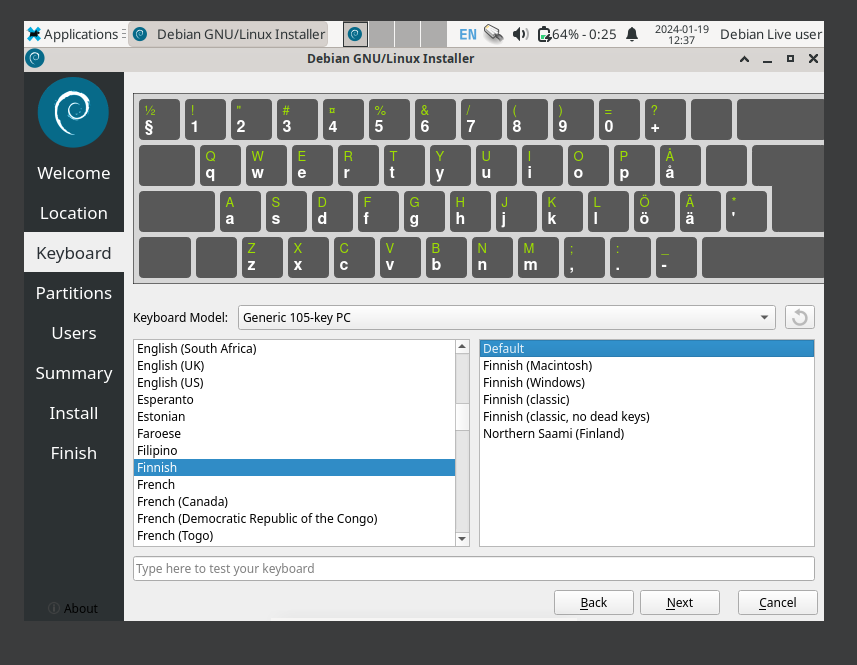
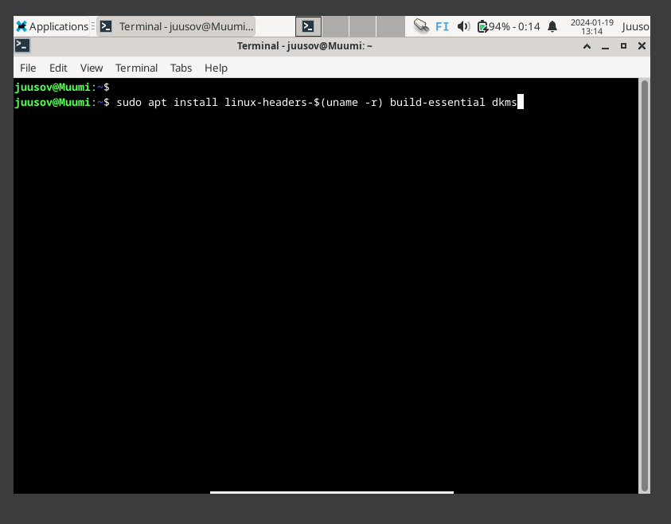

# Introduction

Assignment x is about summarization of two different topics and posts. Topic one is a guide on how to write good reports in the field of information technology. The post is written by Tero Karvinen (2006) at [terokarvinen.com](https://terokarvinen.com/2006/raportin-kirjoittaminen-4/). The other topic is an explanation of free software. The post can be found at [gnu.org](https://www.gnu.org/philosophy/free-sw.html). The writer of this particular post is anonymous. The summarization is expected to be short and sweet with a couple of bullet points.
Assignment a is about installing Linux distribution named Debian on a virtual machine and writing a comprehensive report on this process. The hypervisor used in this task is Virtualbox.

## How to write a report by Tero Karvinen shortly summarized

- According to the author of this post Tero Karvinen (2006) the report should be as detailed as possible. A more detailed a report is, the more time can be saved when doing the same process over again.
- Tero (2006) recommends to write the report while doing the new process. A comprehensive report will help in the form of instructions for other actors (Karvinen 2006) as well as for the author themselves.
- The report should be so comprehensive that the results should stay the same no matter who goes through the process explained on the report, excluding obvious variables such as computer model, processor differences, network differences, location differences and so on (Karvinen 2006).
- Tero (2006) states that things like the timestamps, issues that appeared and how to fix them, what tests were done and in what order, what was done in form of commands and clicks make a report more detailed and better. Also Tero (2006) guides the reader to write the reports in past tense. My take on this would be that the usage of past tense would make the report more readable and narrative. It creates a story for the reader to follow.
- One importand aspect of writing good reports brought up by Tero (2006) is that the report should be easy to read. Things like good grammar, fluent writing, accessible size and the usage of headings and subheadings make a report more accessible and easier to follow (Karvinen 2006).
- Last but definitely not the least, Tero (2006) has written that the usage of references are very important and it is also advised to license your work. Plagitarism and fabrication of lies are very much prohibited (Karvinen 2006).

## What is a free software by GNU summarized

- A free software isn't necessarily always free as in cost (GNU s.a) but the concept of free software holds a deeper meaning. The post by GNU (s.a) states that the ultimate definition of a free software is that the users of a mentioned software have the freedom to use, distribute, modify and copy the said software.
- It is said by GNU (s.a) that a software that isn't open source may give the makers of the propietary software power that isn't always justifiable.
- Essentially a free software needs four aspects of freedom to be categorized as a free software (GNU s.a). The four freedoms are as follows, freedom of inspecting the program like it is and changing it the way the user wants, freedom of running the program as a user wants, freedom of copying and distributing the said program as it is and finally the freedom of distributing your modified version of a said program (GNU s.a).
- GNU (s.a) states that in a scenario where a free program uses another program, the second used program needs to be free as well or the main program won't be classified as free.
- Free software doesn't mean that it's not commercial, in fact without commercially available free software the free software community would suffer from restrictions thus making the "free software" not free anymore (GNU s.a)
- Since a user can use, study, distribute and modify the free software, when a user decides to distribute the program forward the user sharing the software cannot "impose their purposes" on the receiving party (GNU s.a)
- Open source code is a prerequisite for a software to even be started to be classified as a free software, since non open source code denies the freedom of inspection of a software in a source code level (GNU s.a).
- GNU (s.a) states that a software can't be classified as free if an user decides to modify a free software with code that needs certain copyrights or licenses that the modder owns. This makes the original open source and free code restrictive since a part of the new code would be behind copyright.
- A modified free program doesn't have to be improved by modding, since that would be restrictive and thus collide with the freedom to modify as you wish. A special freedom was also stated in the post. This freedom is a freedom to delete the program. (GNU s.a)
- One aspect of freedom to distribute and modify is that a user can modify the program as the user pleases and can use it privately by themselves without the need to tell anyone they exist.
- Copyleft rule states that when distributing free software modded or as it is, the distributor cannot and restrictions to the free software thus making it not free anymore (GNU s.a)
- If a person would modify a free software in a way that makes it more personal it would be okay distribute as long as it doesn't hamper the core freedoms. Also, if an earlier developer asks for a copy, you as a modder are obliged to send one. (GNU s.a)
- Since cross country regulations may affect negatively to distributions or usages of free software, developers should not force these regulations into their conditions. This way a free software won't force users to adhere to a certain countries regulations. (GNU s.a)
- A free license is permitted to lay down the laws to follow (GNU s.a)
- Contract based licenses are more prone to cancelling the software of the ability to be free, since contracts can be naturally quite restrictive (GNU s.a).

## Installing Debian on Virtualbox report

### Background information

First and foremost I checked my system information from a Windows application called System information. I did it by opening the Windows search bar and writing sysinfo and opening the app.

Essential information includes, laptop model which is Lenovo Thinkpad t14 gen 2a, processor which is AMD Ryzen 3 pro 5450U with Radeon graphics 2600Mhz 4 cores and 8 logical processors, x64-based, 16GB of RAM and an SSD with approximately 400GB of free space also I used Windows 11 pro edition. Other notable information include the date, time of day, location and network. This was done on the 19th of January 2024. The time was 11:14 AM at the start. During the process I was in north-east of Helsinki while visiting my relatives. I used a wireless connection instead of a wired connection. To be noted that the connection was really slow.

### Downloading and installing the needed tools

At 11:18 AM I started to search for and download the needed parts for this to work. First I opened my browser which is in my case Google Chrome. I typed Virtualbox into the searchbar. I already know that the Virtualbox.org is the correct site since I've done this before.

I opened the site and clicked on downloads at the left side of the site. Here I clicked on the Windows hosts package which started the download.

I also opened the SHA256 checksums and checked if the downloaded file matched with the checksums. I did this by opening Powershell, writing these commands and comparing both sums.

They matched so the file I downloaded should be ok. At this point I uninstalled my Virtualbox to go through the installation process again from scratch. I did this by going to the Windows control panel and clicking uninstall on Virtualbox. After this I launched the newly downloaded installer from the downloads folder by double clicking it. Didn't make any configuration changes.

At this point I still clicked yes. The dependencies can be configured later if I would need them. After installation I deleted my earlier Debian virtual machine to start from scratch. Then I went to the official Debian website at debian.org. Here I navigated to the other downloads since the big download button automatically downloads a non live version.

Here I clicked on the "try Debian live before installing.

Here I clicked on the one that doesn't download it via BitTorrent.

Here I scrolled down to find this. Then I clicked it to start the download. After the download was finished I checked the sums like I did earlier with the Virtualbox download.

### Creating a VM and testing the live image

Next I opened the Virtualbox app and clicked on new.

Here is the settings I configured. It's important to change the os from 32bit to 64 since this iso image automatically assigns 32bit.

Then I clicked on start.

Then clicked on the first option which opens the live image. At this point it was 12:24 PM. When the desktop environment opened I tested a few things to make sure that it's working as intended.

I opened the web browser and searched for wikipedia.org which seemed to work. Then I opened the terminal and used whoami command which returned the value user. At this point we can conclude that the keyboard, mouse, terminal and internet works as intended.

### Installing Debian from the live image

Then I opened the install Debian app at the desktop.

Launched anyway since it came with the Debian itself.

Plugged the computer into a power source. Launched the application again.

Then selected Helsinki Finland.

Selected Finnish keyboard layout with default setup and tested the unique characters for example ä and å.

Made sure that the storage device was correct and selected erase disk. Also made sure that the boot loader was set to MBR.

Filled my name, created a username and host name. Created a strong password with lowercase and uppercase letters and special characters.

Then started the installation process. At this point it was 12:53 PM and I restarted the vm. It restarted without an issue.

### Essential procedures

Then I just logged in.

Updated and upgraded the packages.

Then I installed ufw, enabled it and checked that the default rules were okay. Then I started to install Virtualbox guest additions. I went on to [this](https://www.youtube.com/watch?v=zdkl16oAS1k) youtube video to grab the first command since I don't remember it myself.

I ran the command and then I clicked on the devices at the top left of the Virtualbox screen. There I clicked on the insert guest additions... 

Then I navigated to the guest additions folder where I ran the autorun.sh file and authenticated. After it was done I restarted the VM. Now the guest additions were installed so after this the resolution can be changed. At the moment it is 1:28 PM and the process has been completed!

## Optional bonus

I decide to make a new directory and inside it put a .txt file using nano.

First I made the directory by changing into desktop and then with the command mkdir.

Then I navigated there and used nano to create a flag.txt file.

I wrote some text and saved it with Ctrl+X, Y and enter.

Then I read the contents of the flag.txt file with the cat command. The reason I named the directory pythonserver is because I wanted to host the flag file inside a Python http server. I did it like this.

First I made sure that I'm in the correct directory and then I ran this command. This opened a simple http server on port 8000. I accessed it by opening my browser and writing this.

Localhost:8000 works aswell. The directory opened and inside was the flag.txt that I opened.

After this test I closed the server with Ctrl+C in the terminal and I was done.

# References

GNU s.a. What is free software? Available at [https://www.gnu.org/philosophy/free-sw.html](https://www.gnu.org/philosophy/free-sw.html). Read on January 17, 2024.

Karvinen, T. June 4, 2006. Raportin kirjoittaminen. Available at [https://terokarvinen.com/2006/raportin-kirjoittaminen-4/](https://terokarvinen.com/2006/raportin-kirjoittaminen-4/). Read on January 17, 2024.

ProgrammingKnowledge2. May 7, 2022. How Install VirtualBox Guest Additions on Ubuntu 22.04 Guest / virtual machine. Youtube video. Available at [https://www.youtube.com/watch?v=zdkl16oAS1k](https://www.youtube.com/watch?v=zdkl16oAS1k). Watched on January 19, 2024.
