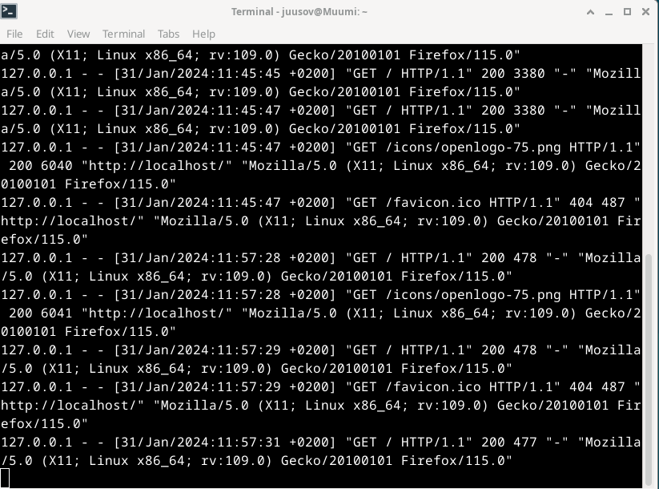
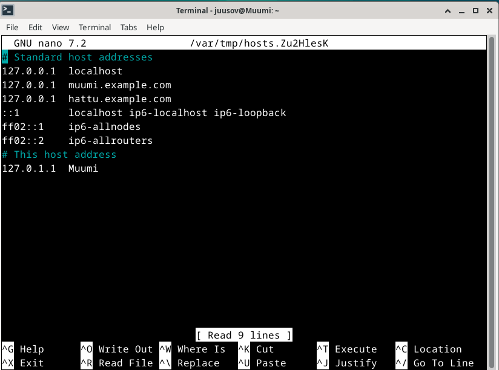

# Introduction

In assignment x by Tero (Karvinen 2024) I'm going to summarize two different posts. These posts are "name-based virtual host support" (Apache s.a) at [https://httpd.apache.org/docs/2.4/vhosts/name-based.html](https://httpd.apache.org/docs/2.4/vhosts/name-based.html) and "name based virtual hosts on apache - multiple websites to single IP address" (Karvinen 2018) at [https://terokarvinen.com/2018/04/10/name-based-virtual-hosts-on-apache-multiple-websites-to-single-ip-address/](https://terokarvinen.com/2018/04/10/name-based-virtual-hosts-on-apache-multiple-websites-to-single-ip-address/). The other assignment is divided into smaller subtasks. These will be done on a Linux system. I used a Linux distribution called Debian on a virtual machine. The hypervisor I used Virtualbox as the hypervisor.

# Name-based virtual host support summed up

- In IP-based virtual hosting different hosts need to have different IP addresses, since the IP addresses are used to find the correct hosts. (Apache s.a.)
- On the other hand with name-based virtual hosting, names can be used to determine the correct hosts. This enables the usage of a single IP address by multiple hosts. (Apache s.a.)
- Apache (s.a) states that it's recommended to use the name-based virtual hosting whenever it's possible. Since multiple hosts can be mapped to a single IP address, it doesn't drain the already scarse pool of IP addresses the same way like IP-based virtual hosting would (Apache s.a). Apache (s.a) also states that the setting up process of a name-based virtual host is pretty simple.
- Name-based virtual hosting builds on IP-based virtual hosting (Apache s.a). This means that the name-based virtual hosting still maps the correct names with the possible hosts with the best IP address (Apache s.a). To bypass this a (*) sign can be set inside the virtualhost directives (Apache s.a). For example <VirtualHost *:80> means that the IP address is irrelevant and it uses the port 80. The * sign can be replaced with an IP address.
- When two or more virtual hosts share the same IP address and port configuration, the ServerName and ServerAlias are used to map the request to the correct host. (Apache s.a)
- Apache (s.a) notes that the virtual host matching can break if the ServerName directive is left out of a name-based configuration.
- When a the ServerName or ServerAlias doesn't match but the IP address and port combination is correct, the first virtual host listed on the configuration file will be used (Apache s.a).
- Different virtualhosts are separated by using the <VirtualHost> </Virtualhost> block (Apache s.a). ServerName and DocumentRoot are the minimum directives that need to be configured inside the virtualhost block (Apache s.a).
- The ServerAlias can be used to configure a server that is more accessible (Apache s.a). For example a ServerName can be shoe.example.com and the ServerAlias can be `www.shoe.example.com` or something like `*.shoe.example.com`. With this the same site can be accessed by using `www.shoe.example.com` or `shoe.example.com`. The * sign is again a wildcard here (Apache s.a).
- Different types of directives can be used inside the VirtualHost block to make the configurations more precise and unique (Apache s.a). For example I added a couple of extra lines into the configuration files. These can be seen in the report below.

# name based virtual hosts on apache - multiple websites to single IP address summed up

- Tero (Karvinen 2018) highlights the same positive feature of name-based configuration by stating that multiple domain names can share the same IP address.
- To install Apache a command like `sudo apt-get -y install apache2` can be used (Karvinen 2018). `-y` just answers the yes/no question automatically. Karvinen (2018) states that with this command `echo "Default"|sudo tee /var/www/html/index.html` the default website can be replaced.
- Sudoedit is used to edit the config file which can be found in `/etc/apache2/sites-available/`. To edit it a command like `sudoedit /etc/apache2/sites-available/filename.conf. (Karvinen 2018)
- Here is a great example of a VirtualHost by Karvinen (2018)

      <VirtualHost *:80>
       ServerName pyora.example.com
       ServerAlias www.pyora.example.com
       DocumentRoot /home/xubuntu/publicsites/pyora.example.com
       <Directory /home/xubuntu/publicsites/pyora.example.com>
         Require all granted
       </Directory>
      </VirtualHost>

- `sudo a2ensite pyora.example.com` enables the conf (Karvinen 2018).  After enabling the conf, `sudo systemctl restart apache2` must be used for changes to take effect (Karvinen 2018).
- Then a correct directory must be made. Tero (Karvinen 2018) brings up this example `mkdir -p /home/xubuntu/publicsites/pyora.example.com/`. To create the web page, an index.html is created using this example `echo pyora > /home/xubuntu/publicsites/pyora.example.com/index.html` (Karvinen 2018).
- To test with curl, `curl -H 'Host: pyora.example.com' localhost` and `curl localhost` are used (Karvinen 2018).
- To locally simulate a name service, the hosts file can be edited with `sudoedit /etc/hosts` (Karvinen 2018).

# Main assignment

## essential information


I decided to export the essential information from Windows system information into sysinfo.txt. I did it by opening the system information application from Windows search bar by typing sysinfo. Once it opened I navigated to the top left of the screen and opened the "file" tab. There I clicked on export and I named the file sysinfo.txt. I opened the file and deleted the other information using shortcut keys. Individual rows with Ctrl + Shift + arrow down and del. All the rest with Ctrl + Shift + end and del. Now I can use this in future reports as well until I need to do a system update. Since storage, place and network information are something that changes all the time I left them out. At this point I had 387GB of free space on my SSD, I was at home in Vaasa and I used my own wireless connection.

## Apache web server

I decided to start working on this assignment at 11:12 AM. First I opened Virtualbox, selected the correct VM and hit start. Then I logged in, opened the terminal and ran ```sudo apt update && sudo apt upgrade```. Then to check the status of apache2 I ran ```sudo systemctl status apache2```.


Exited the view with q and opened Firefox. Typed localhost and pressed enter. I was working correctly.


Since I did one of the optional tasks already during the last lecture, the site was also reachable with muumi.example.com.


I still decided to do the task again later during this report just to practice. I was done with this at 11:21 AM.

## Log files

at 11:27 AM I opened the access logs with ```sudo tail /var/log/apache2/access.log```.


This showed the logs from the day before. So i had a problem and I started troubleshooting. First I decided to restart the apache2 with ```sudo systemctl restart apache2```. Then checked that it restarted.


Then I opened another terminal to run ```sudo tail -f /var/log/apache2/access.log```. Now I was able to check the access logs in real time. Also checked the error logs and found nothing.


I decided to check if the default conf evokes any logs since I thought about the timestamps and realised that at that time I probably used the default conf instead of my own.


Checked the site and then checked the logs and noticed that my deduction was indeed correct.


So with this information I came to the conclusion that there was something wrong with configurations since the default conf writes to the logs but my conf doesn't. I compared the two and immediately found the problem.


My config didn't have the access or error logs configured. I copied the lines from the default conf and placed them inside my conf.


Then did the usual and checked the site and logs.


Now those two work.




    127.0.0.1 - - [31/Jan/2024:11:57:31 +0200] "GET / HTTP/1.1" 200 477 "-" "Mozilla/5.0 (X11; Linux x86_64; rv:109.0)     
    Gecko/20100101 Firefox/115.0"

First I'll explain the things I know myself and the rest I'll explain using references.

First 127.0.0.1 is the IP address. This time it's the loopback address also knows as localhost. Next up is the [date/month/year:time and timezone (+0200)]. "GET / HTTP/1.1" means that the device requested information from the site. HTTP/1.1 is the protocol that was used. 200 means that the response was ok. The last bit says that Mozilla Firefox is the browser used in a Linux OS.

Now with using a post by Apache (s.a. Log files) as a reference. The - - at the start means that the requested information is not available (Apache s.a. Log files). The number after the 200 should mean the size of an object returned (Apache s.a. Log files). In this case it would be 477 but after it, is a "-" which should mean that no content was returned (Apache s.a. log files). After analyzing the document about logs (Apache s.a. log files) I realized that the "-" in this context means that the referer information was not available. The last bit with browser info is called "user agent" (Apache s.a. log files). Mozilla/5.0 says that the browser is Mozilla compatible (Mozilla s.a). (X11; Linux x86_64; rv:109.0) is the platform used and rv:109.0 is the Gecko version (Mozilla s.a). Gecko/20100101 says that the browser is based on Gecko and the 20100101 is always the same (Mozilla s.a). Firefox/115.0 is the browser and the version (Mozilla s.a).

There is a line where the status code is 404 in my screenshot. `"GET /favicon.ico HTTP/1.1" 404 487 "http://localhost/"`. Here the client which was I tried to get the /favicon.ico with HTTP/1.1 protocol. Unfortunately it was unsuccesful since the return code was error code of 404. We can see the referer here which was http://localhost/.

I was happy and done at 11:59 AM.

## New website hattu.example.com

After a small break I started working on this task. It was 12:09 PM. First I created the configuration file for hattu.example.com.


While using my muumi.example.com config file as a reference I found a couple of typos. I had <Directory> ... > and my closing had </Virtualhost> with a h lowercased.


I decided to check the syntax again and it says that the syntax is ok like it said when I created it.


Seems like these typos don't matter that much. Anyway I made a config file for hattu.example.com with these typos corrected. I wrote the whole thing manually so it would be better engraved into my brain. Disabled muumi config and enabled hattu config. Then I tested the config and it seems to be ok.


The warning about the documentroot was expected since I didn't create the directory yet. Next I created the directory by jumping to the publicwebsite directory.


Created the correct directory and jumped there. made an index.htlm file.


Restarted apache2 and opened FIrefox.


It worked. Opened the index with micro once again to write some HTML code into it.


Wrote some code and checked the site once more.


I was done at 12:41 PM.

## A valid HTML5 site

Navigated to HTML5 validator site at 12:43 PM. I just opened the browser and typed HTLM5 validator and opened the first one since I've used it a couple of times before. Then I realized that I was at using my host machine for this and changed back to the virtual machine and I redid the process.


I copied the code and inserted it into the validator.


The page was valid! I was done at 12:48 PM.

## curl -I and curl

I used curl and curl -I at 12:53 PM to fetch information from the new hattu website.


curl returned the source code of hattu.example.com.


      HTTP/1.1 200 OK
      Date: Wed, 31 Jan 2024 10:54:10 GMT
      Server: Apache/2.4.57 (Debian)
      Last-Modified: Wed, 31 Jan 2024 10:40:25 GMT
      Etag: "ea-6103b81b1d414"
      Accept-Ranges: bytes
      Content-Length: 234
      Vary: Accept-Encoding
      Content-Type: text/html

HTTP/1.1 is the protocol used and 200 OK means that the response status was ok. Date: has the date, month, year, time and timezone. Server: tells us that the server is Apache version 2.4.57 and it's running on Debian. Next line says when the page was last modified at. Content-type is text/html. Content-Length: is the size of the response. Mozilla states (Mozilla s.a) that an etag (entity tag) is a unique tag for a resource version.

I was done at 12:55 PM. At this point I decided to have a lunch break since I had a lecture coming up at 2:00 PM.


## Name based virtual host (optional)

At 5:41 PM I'm back in business. My task was to simulate a name service with the hosts file. I've done this once before but I decided to do it again with the hattu website. I started the VM once more and ran ```sudo update```. Then I needed to make changes to the hosts file. I opened it with sudoedit.


Here we can see that I've added the muumi.example.com already.


Then I added the hattu.example.com right after muumi. Ctrl + X, Y and enter to save and exit.


To test this I opened the browser and typed hattu.example.com. And it works!


And to show that this isn't some type of fluke, I added the letter s to the url and it doesn't work since the url is wrong.


I was done at 5:50 PM.

## Two websites with two names (optional)

Here I was supposed configure two websites with the single device. I started at 5:51 PM and first I decided to quickly check the "name-based virtual host support" page from Apache (s.a). I clearly states how it's done so I got to work. I opened the enabled conf which was the hattu.example.com.conf and added the muumi details as another virtualhost.


This time I decided to use NANO and this time also I wrote the info manually. Restarted for a good measure.


And there we have it, I got both working.


I didn't need to add the muumi.example.com again to the hosts file since I had added it way before. Here's the last look at the current hosts file.



I was done at 6:10 PM.

## Get the Github Education Pack (optional)

COMING SOON...

# References

Apache, s.a. Name-based Virtual Host Support. Available at [https://httpd.apache.org/docs/2.4/vhosts/name-based.html](https://httpd.apache.org/docs/2.4/vhosts/name-based.html). Read on January 31, 2024.

Apache, s.a. Log Files. Available at [https://httpd.apache.org/docs/2.4/logs.html](https://httpd.apache.org/docs/2.4/logs.html). Read on February 1, 2024.

Karvinen, January 11, 2024. Linux Palvelimet 2024 alkukevät. Available at [https://terokarvinen.com/2024/linux-palvelimet-2024-alkukevat/](https://terokarvinen.com/2024/linux-palvelimet-2024-alkukevat/).

Karvinen, April 10, 2018. Name Based Virtual Hosts on Apache – Multiple Websites to Single IP Address. Available at [https://terokarvinen.com/2018/04/10/name-based-virtual-hosts-on-apache-multiple-websites-to-single-ip-address/](https://terokarvinen.com/2018/04/10/name-based-virtual-hosts-on-apache-multiple-websites-to-single-ip-address/). Read on January 31, 2024.

Mozilla s.a. User-Agent. Mdn web docs. Available at [https://developer.mozilla.org/en-US/docs/Web/HTTP/Headers/User-Agent](https://developer.mozilla.org/en-US/docs/Web/HTTP/Headers/User-Agent). Read on February 1, 2024.

Mozilla s.a. ETag. Mdn web docs. Available at [https://developer.mozilla.org/en-US/docs/Web/HTTP/Headers/ETag](https://developer.mozilla.org/en-US/docs/Web/HTTP/Headers/ETag). Read on February 1, 2024.
