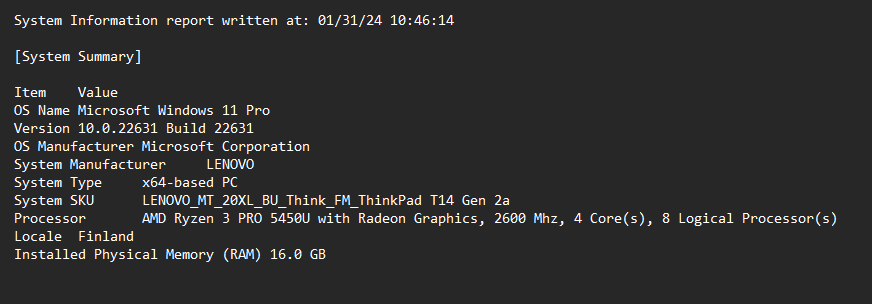
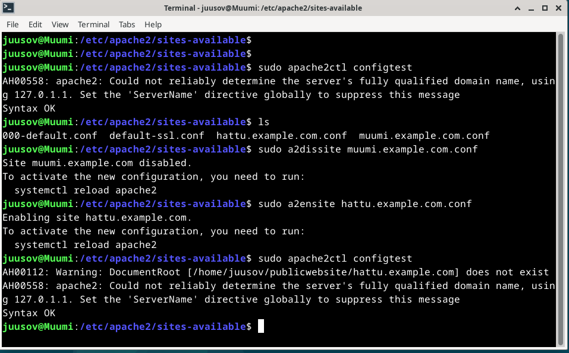
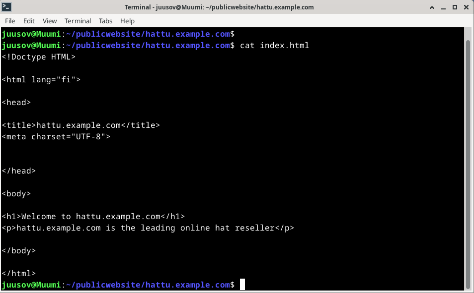

# Introduction

In assignment x by Tero (Karvinen 2024) I'm going to summarize two different posts. These posts are "name-based virtual host support" (Apache s.a) at [https://httpd.apache.org/docs/2.4/vhosts/name-based.html](https://httpd.apache.org/docs/2.4/vhosts/name-based.html) and "name based virtual hosts on apache - multiple websites to single IP address" (Karvinen 2018) at [https://terokarvinen.com/2018/04/10/name-based-virtual-hosts-on-apache-multiple-websites-to-single-ip-address/](https://terokarvinen.com/2018/04/10/name-based-virtual-hosts-on-apache-multiple-websites-to-single-ip-address/). The other assignment is divided into smaller subtasks. These will be done on a Linux system. I used a Linux distribution called Debian on a virtual machine. The hypervisor I used Virtualbox as the hypervisor.

# Name-based virtual host support summed up

# name based virtual hosts on apache - multiple websites to single IP address summed up


# Main assignment

## essential information



I decided to export the essential information from Windows system information into sysinfo.txt. I did it by opening the system information application from Windows search bar by typing sysinfo. Once it opened I navigated to the top left of the screen and opened the "file" tab. There I clicked on export and I named the file sysinfo.txt. I opened the file and deleted the other information using shortcut keys. Individual rows with Ctrl + Shift + arrow down and del. All the rest with Ctrl + Shift + end and del. Now I can use this in future reports as well until I need to do a system update. Since storage, place and network information are something that changes all the time I left them out. At this point I had 387GB of free space on my SSD, I was at home in Vaasa and I used my own wireless connection.

## Apache web server

I decided to start working on this assignment at 11:12 AM. First I opened Virtualbox, selected the correct VM and hit start. Then I logged in, opened the terminal and ran ```sudo apt update && sudo apt upgrade```. Then to check the status of apache2 I ran ```sudo systemctl status apache2```.


Exited the view with q and opened Firefox. Typed localhost and pressed enter. I was working correctly.


Since I did one of the optional tasks already during the last lecture, the site was also reachable with muumi.example.com.


I still decided to do the task again later during this report just to practice. I was done with this at 11:21 AM.

## Log files

at 11:27 AM I opened the access logs with ```sudo tail /var/log/apache2/access.log```.


This showed the logs from the day before. So i had a problem and I started troubleshooting. First I decided to restart the apache2 with ```sudo systemctl restart apache2```. Then checked that it restarted.


Then I opened another terminal to run ```sudo tail -f /var/log/apache2/access.log```. Now I was able to check the access logs in real time. Also checked the error logs and found nothing.


I decided to check if the default conf evokes any logs since I thought about the timestamps and realised that at that time I probably used the default conf instead of my own.


Checked the site and then checked the logs and noticed that my deduction was indeed correct.


So with this information I came to the conclusion that there was something wrong with configurations since the default conf writes to the logs but my conf doesn't. I compared the two and immediately found the problem.


My config didn't have the access or error logs configured. I copied the lines from the default conf and placed them inside my conf.


Then did the usual and checked the site and logs.


Now those two work.


I was happy and done at 11:59 AM.

## New website hattu.example.com

After a small break I started working on this task. It was 12:09 PM. First I created the configuration file for hattu.example.com.


While using my muumi.example.com config file as a reference I found a couple of typos. I had <Directory> ... > and my closing had </Virtualhost> with a h lowercased.


I decided to check the syntax again and it says that the syntax is ok like it said when I created it.


Seems like these typos don't matter that much. Anyway I made a config file for hattu.example.com with these typos corrected. I wrote the whole thing manually so it would be better engraved into my brain. Disabled muumi config and enabled hattu config. Then I tested the config and it seems to be ok.



The warning about the documentroot was expected since I didn't create the directory yet. Next I created the directory by jumping to the publicwebsite directory.


Created the correct directory and jumped there. made an index.htlm file.


Restarted apache2 and opened FIrefox.


It worked. Opened the index with micro once again to write some HTML code into it.


Wrote some code and checked the site once more.


I was done at 12:41 PM.

## A valid HTML5 site

Navigated to HTML5 validator site at 12:43 PM. I just opened the browser and typed HTLM5 validator and opened the first one since I've used it a couple of times before. Then I realized that I was at using my host machine for this and changed back to the virtual machine and I redid the process.


I copied the code and inserted it into the validator.




The page was valid! I was done at 12:48 PM.

## curl -I and curl

I used curl and curl -I at 12:53 PM to fetch information from the new hattu website.


I was done at 12:55 PM. At this point I decided to have a lunch break since I had a lecture coming up at 2:00 PM.

## Get the Github Education Pack (optional)

## Name based virtual host (optional)

## Two websites with two names (optional)
