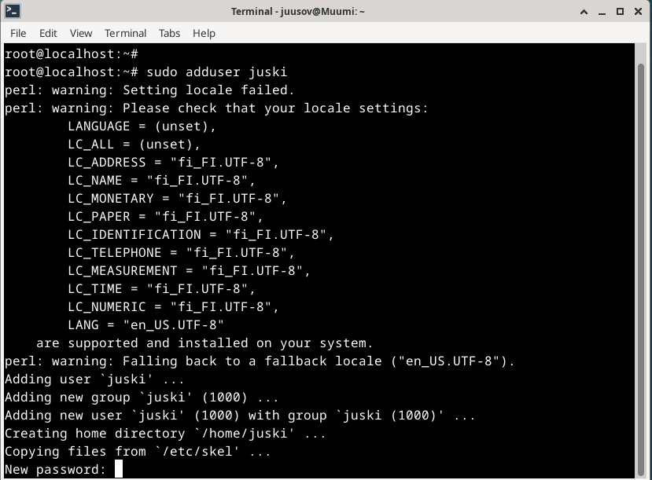
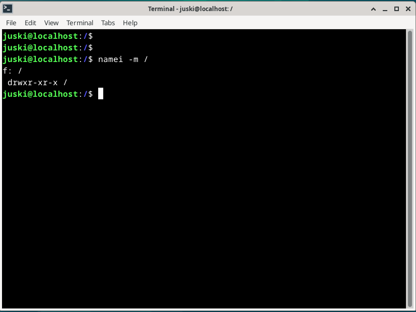

# Introduction

In task x (Karvinen 2024), I was assigned to summarize two different posts. The first post is a report by Susanna (lehto 2022) titled "Teoriasta käytäntöön pilvipalvelimen avulla (h4)" and it can be found at [https://susannalehto.fi/2022/teoriasta-kaytantoon-pilvipalvelimen-avulla-h4/](https://susannalehto.fi/2022/teoriasta-kaytantoon-pilvipalvelimen-avulla-h4/) and the second post is guide by Tero (Karvinen 2017) titled "First Steps on a New Virtual Private Server – an Example on DigitalOcean and Ubuntu 16.04 LTS" and it can be found at [https://terokarvinen.com/2017/first-steps-on-a-new-virtual-private-server-an-example-on-digitalocean/](https://terokarvinen.com/2017/first-steps-on-a-new-virtual-private-server-an-example-on-digitalocean/).

The rest of the assignment is again divided into subtasks. I was supposed to rent a vm from the cloud, configure it and make it host a website. Finally, I also had to rent a domain name which I already had done before this assignment.

# "Teoriasta käytäntöön pilvipalvelimen avulla (h4)" summed up

I only needed to summarize parts "renting from the cloud", "secure the server with a firewall", configuring a homepage" and "updating/upgrading software" (Karvinen 2024)

- Susanna (Lehto 2022) decided to utilize the GitHub education pack to get herself a free server and a free domain name. DigitalOcean and Namecheap were the providers used (Lehto 2022)
- Lehto (2022) registered manually since the sale promo code for DigitalOcean didn't work. She needed to enter her credit card info and pay a one-dollar confirmation fee which was promised to be returned. (Lehto 2022)
- After gaining access to the dashboard she decided to input the promo code once again. She also added a billing alert from the billing tab. (Lehto 2022)
- Susanna (lehto 2022) created a virtual machine by clicking a tab named droplet, clicking create a droplet, choosing Debian 11 as the image, choosing the cheapest option from shared CPU and basic plan, choosing datacenter location to be Amsterdam, creating a strong root password, skipping the additional options section and finally selecting the amount to be one machine and creating the droplet with "create droplet". After approximately a minute, DigitalOcean had finalized creating the machine and then showed the IP address to Susanna (Lehto 2022).
- To get the .me domain suffix for free for a year, Susanna (lehto 2022) connected her GitHub account to namecheap from the GitHub education site. Once in namecheap for education, she searched for and chose a domain name with her full name (Lehto 2022).
- Lehto (20220) completed the order by filling out mandatory info. She couldn't login with her GitHub account, so she decided to sign up with a new account. She then linked her GitHub account with the new account. (Lehto 2022)
- Then she navigated to domain list and from there to advanced dns to delete the default records. Then she added two new A-records. (Lehto 2022)
- She then connected to the new server with SSH and ran `sudo apt-get update` (Lehto 2022).
- Susanna (Lehto 2022) installed ufw with `sudo apt-get install ufw`, made a hole with `sudo ufw allow 22/tcp` and enabled the firewall with `sudo ufw enable`.
- Lehto (2022) created a new user with `sudo adduser suska`. She decided to input her full name which I decided leave blank. Lehto (2022) then added the new user to the sudo group using `sudo adduser suska sudo`.
- She then connected via SSH using the new user. I worked and she then ran `sudo apt-get update` once more. (Lehto 2022)
- Lehto (2022) locked the root user with `sudo usermod –lock root` and pinged the domain name. To kill the ongoing ping process, she closed the terminal (Lehto 2022).
- Lehto (2022) connected via SSH once more and ran `sudo apt-get update`, `sudo apt-get upgrade` and `sudo apt-get dist-upgrade` to update/upgrade. She then installed Apache with `sudo apt-get install apache2`, Opened another port with `sudo ufw allow 80/tcp` and replaced the default site with `echo Hello world! |sudo tee /var/www/html/index.html` (Lehto 2022).
- She decided to use a module called userdir. To deploy this module, she used `sudo a2enmod userdir`. She then installed micro and made an index.html file inside public_html. Inside the file she wrote some html code. With another computer she tried to access the website with Chrome and it worked. (Lehto 2022)
- Last but not least she updated/upgraded the software with `sudo apt-get update`, `sudo apt-get upgrade` and `sudo apt-get dist-upgrade`. (Lehto 2022)

# "First Steps on a New Virtual Private Server – an Example on DigitalOcean and Ubuntu 16.04 LTS" summed up

- With the GitHub education pack, you can get some awesome perks such as but not limited to virtual private server and .me domain for a limited time (Karvinen 2017).
- To create a virtual server on digital ocean one must register, add a credit card or a promo code, create a new resource, choose a datacenter near customers, configure a password or SSH keys and create the resource. Then it can be accessed with the public IP address and SSH. For example ssh root@IPaddres. Always give strong passwords! (karvinen 2017)
- Karvinen (2017) guides to make a hole for SSH before enabling the firewall. A hole is made with `sudo ufw allow 22/tcp` (Karvinen 2017). 22 is the default SSH port and TCP is a protocol. To enable the firewall Tero (Karvinen 2017) says to use `sudo ufw enable`.
- Karvinen (2017) says "One human, one account, named after this human.". First to create a user a command `sudo adduser username` is used and to add the user into different groups a command `sudo adduser username groupname` is used. (Karvinen 2017)
- It is best practice to verify that the new user works as intended by opening a new local terminal and establishing an SSH connection with `ssh username@IPaddress (or domain name)` before closing the active connection on the other terminal (Karvinen 2017).
- Then the root password can be locked with `sudo usermod --lock root` (Karvinen 2017). To disable the root login, changes must be made to the sshd_config file residing in /etc/ssh/. There a value "yes" needs to be changed to value "no" on a line that says "PermitRootLogin". After making changes to the configurations, the service must be restarted with `sudo service ssh restart`
- Upgrading software is a must (Karvinen 2017). `sudo apt-get update` and `sudo apt-get upgrade` does the trick (Karvinen 2017).
- Then you can start using it. Karvinen (2017) reminds us to open a port for the server. For example, 80/tcp would make connections using HTTP possible from the outside.
- Domain name makes the site much more accessible. Namecheap is a good place for renting names. (Karvinen 2017)

# The main task

## Essential information

I started this task at 9:41 AM on February 7th. I was at home in Vaasa at the time. I used the picture I took last time since it was still valid.

In addition to the information on the picture, I used a wireless connection which was great and I had 386 GB of free space on my SSD. Also I decided to list the specs of my virtual machine. I grabbed the information by opening VirtualBox and selecting the correct VM.

Have to say that the mouse that I was using was dying. It really got on my nerves and made the whole process longer since it would usually register a click multiple times etc. A laggy mouse and a slower internet connection together weren't the best combo. I'm happy that I went ahead and bought a new mouse when taking care of other business. The new mouse made the last part of this process much more enjoyable.

## Renting a VM from the cloud

I started doing this task at 9:49 AM. I already had an account so I only had to log in. First I a new tab on my browser and searched for Linode.

Opened the correct site, navigated to the top right corner and hit log in.

Typed my credentials and I was in. I clicked on "create a linode",

chose Debian 12 as the image, Stockholm, SE as the region and switched to shared CPU and chose the cheapest option.

Created a label and a strong root passphrase.

Then I hit create Linode and it was running in under a minute.

I was done with this at 10:04 AM. I had to take care of a couple of things, so I decided to power off the machine for that time just to be safe.

## First steps

After taking care of a couple of mandatory things I was back at 10:24 AM. First, I powered the machine on.

I opened my own VM in VirtualBox by selecting it and pressing start. Did the usual by opening the terminal and ran `sudo apt update` and `sudo apt upgrade`. Tried to connect with ssh and I had a problem.

My VM didn't have the ssh client, so I installed it.

I couldn't connect so I tried it again and again a couple of times.

Then it asked for a password, and I typed it. Then I was in, and I was a little confused on why it had root@localhost. I thought that I had set the name to be weppi. I ran `sudo apt update` and then I installed ufw with `sudo apt install ufw`. Then I had to make a hole in the firewall for port 22.

I was using sudo even though I was root because using sudo logs the events. I checked the added rules before enabling the ufw.

It was ok so I enabled the firewall.

At 11:17 AM I ran `sudo apt update` and `sudo apt upgrade`. Had a problem with upgrade.

I just clicked an option that said, "install a maintainers version". I then searched for it on the web and found a community post (DigitalOcean 2023). After reading the answer in the digitalOcean community post I came to the conclusion that I made the right choice since I didn't do any modifications to the sshd config beforehand. Then I created a user and added it to the sudo and adm groups (Karvinen 2017).

Connected with the new account and it worked.

Double checked the groups.

Locked the root password (Karvinen 2017).

Then I disabled the root login by opening the config file with `sudoedit /etc/ssh/sshd_config` and changing a value to no (Karvinen 2017).

Tried to login as root and it didn't work so that was good.

This task was completed at 11:40 AM.

## Web server

On February 8th I continued my work. I started this doing task at 8:55 AM. Some changes to the essential information include the change of location and network connectivity. I arrived in Helsinki yesterday evening. So, at this time I was in Helsinki visiting relatives and I was using a wireless connection that was notably slower than mine at home.

First, I launched my VM by opening the Virtualbox application and hitting start. I opened the terminal and ran `sudo apt update`. Then I had to start the server residing in the cloud since I powered it off last time. So, I searched for Linode, opened the correct site, logged in, selected the correct VM and hit "power on". I then connected via ssh.

When I was in I ran `sudo apt update` and installed Apache2.

I then enabled the service but to my surprise it was already enabled.

After this I checked the default site with curl.

I installed micro, navigated to the `/etc/apache2/sites-available` directory with `cd /etc/apache2/sites-available` made a new configuration file in `/etc/apache2/sites-available`.

I'm surprised on how well I remembered this basic conf. I only needed to cheat on the "require all granted" part. I used my own picture as a reference (GitJuski 2024).

Anyways then I navigated to the /home/juski dir with `cd`. There I created the correct directories, and I then created an index.html file.

I created another hole to test the default conf.

Then I disabled the default conf and enabled my conf.

I tested the conf and it was ok.

Then I restarted Apache.

Checked the site with IP address and I had a problem once again.

I added the error log into my new config file (GitJuski) and opened the site again to log the error.

I opened the error logs with `sudo tail /var/log/apache2/error.log`. Well, the error.log had only earlier errors.

After restarting Apache, opening the site and opening the logs I realized that it logs the errors but in a different time...

Inadequate permissions!

After a while of checking permissions, I found that the /home/juski has tight permission and that it is probably the source of the error message.

Well at this point I was closer to the solution but I got some things to take care of, so I had to stop here and continue this later. It was 10:53 AM at the time.

I was back in business at 7:06 PM with a new mouse! Now I was in a bit of a pickle. I could mod the /home/juski dir permissions or I could use the /var/www/html as the documentroot. Either of these would probably fix the issue. I had a feeling that the permissions mod would create a security risk since I'm giving more permissions to /home/juski directory, On the other hand the whole point of this machine is to host a website and nothing else. I decided to try if the modification of permissions would work. So I found a command `namei -m` (StackExchange, answer by user59736 2014) and I used `namei -m /home/juski/publicwebsite/`. The output clearly showed that the juski directory was missing permissions so I ran `sudo chmod +x juski`. After running this command an x spawned at the end and middle of the juski line. This essentially means that the group juski and others have x (execute) permissions here.

This was almost the same as in the other VM.

Well, this setup works.

I decided to play around with the permissions for a while to study them. In the end I gave the same permissions as in the other VM.

## UPDATE February 13, 2024 11:08 AM. Decided to change the permissions a little.

Update 2 February 13, 2024 1:55 PM. I ran into a problem with reading files in / so I changed the permissions there.

## UPDATE concluded

I made a short html page and tested it.

I was done at 7:41 PM.

## Domain name

Immediately after I started to work on this task. First, I opened a new tab on a browser and searched for Namecheap.

namecheap.com is the right address so I clicked it and signed in with my credentials. I scrolled down to find the correct domain that I already owned.

There I clicked "manage". Here I opened the advanced dns tab and deleted the default records.

I added two A-records with a 30min TTL (Time To Live) (Namecheap 2021).

I tested it pretty much immediately and it responded!

I was done with this at 8:00 PM. After this I added the access logging into the website configuration. I wanted to use ssh keys, so I decided to do it as an optional personal task the next day.

## Optional task for personal use (I will do this some other time)

I wanted to configure SSH keys, change the default port for SSH login, Check the SSH configurations thoroughly and make the site more appealing. Unfortunately, I had other things to focus on so I decided to do this some other time once I have more time on my hands. So, this part is still in "COMING SOON..." state.

# References

DigitalOcean. October 25, 2023. sudo apt upgrade, offers some questions? A community post. Available at [https://www.digitalocean.com/community/questions/sudo-apt-upgrade-offers-some-questions](https://www.digitalocean.com/community/questions/sudo-apt-upgrade-offers-some-questions). Read on February 7, 2024.

GitJuski. February 1, 2024. h3-GJ. Github. Available at [https://github.com/GitJuski/Linux-servers/blob/main/h3-GJ.md](https://github.com/GitJuski/Linux-servers/blob/main/h3-GJ.md).

Karvinen, T. January 11, 2024. Linux Palvelimet 2024 alkukevät. Available at [https://terokarvinen.com/2024/linux-palvelimet-2024-alkukevat/](https://terokarvinen.com/2024/linux-palvelimet-2024-alkukevat/).

Karvinen, T. September 19, 2017. First Steps on a New Virtual Private Server – an Example on DigitalOcean and Ubuntu 16.04 LTS. Available at [https://terokarvinen.com/2017/first-steps-on-a-new-virtual-private-server-an-example-on-digitalocean/](https://terokarvinen.com/2017/first-steps-on-a-new-virtual-private-server-an-example-on-digitalocean/). Read on February 7, 2024.

Lehto, S. February 14, 2022. Teoriasta käytäntöön pilvipalvelimen avulla (h4). Available at [https://susannalehto.fi/2022/teoriasta-kaytantoon-pilvipalvelimen-avulla-h4/](https://susannalehto.fi/2022/teoriasta-kaytantoon-pilvipalvelimen-avulla-h4/). Read on February 7, 2024.

Namecheap. Updated on July 7, 2021. How can I set up an A (address) record for my domain?. Available at [https://www.namecheap.com/support/knowledgebase/article.aspx/319/2237/how-can-i-set-up-an-a-address-record-for-my-domain/](https://www.namecheap.com/support/knowledgebase/article.aspx/319/2237/how-can-i-set-up-an-a-address-record-for-my-domain/). Read on February 8, 2024.

User57936 answer. February 6, 2014. Title of the question "View permission / owner of full directory tree". StackExchange. Available at [https://unix.stackexchange.com/questions/82361/view-permission-owner-of-full-directory-tree](https://unix.stackexchange.com/questions/82361/view-permission-owner-of-full-directory-tree). Read on February 8, 2024.
