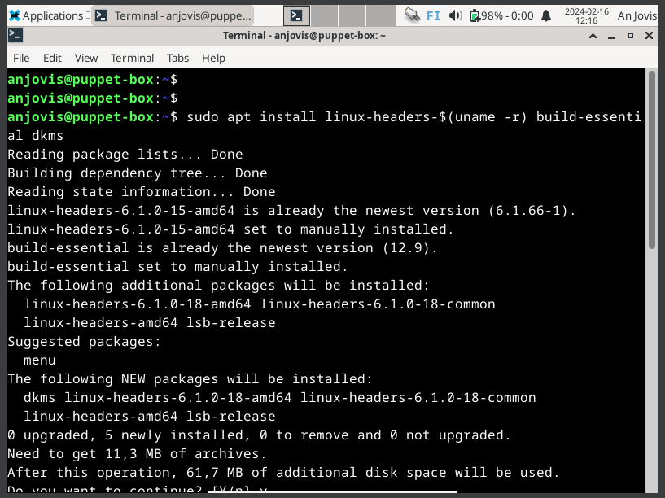

# Introduction

It's time for homework assignment number five. There was no need to summarize posts this time. The assignment is divided into subtasks a, b, c and an optional task m.

- In task a, I was supposed to configure a fresh virtual machine that had Apache and an SSH-server installed on it. The purpose of the machine was to host a website using virtual-based host techniques. This task could be done locally within VirtualBox.
- In task b, I was supposed to configure SSH key authentication for this new VM.
- Task c was about analyzing and comparing information on my domain name with outputs from the `hosts` and `dig` commands, as well as information about my domain name from the tenant's page, which in my case is Namecheap.com.
- The optional task was to install Vagrant and configure a virtual machine with it.

(Karvinen 2024)

# Essential information

This screenshot is still valid even though I've updated the system in between. I should provide some information on the specs listed, so that those who aren't as tech-savvy can understand the starting point as well.
- OS Name - This is the operating system name. Windows 11 is the newest Windows OS. Pro version is a version with some additional features. The home version is the usual version people use at home and the pro version is more tailored towards business use.
- Microsoft is the manufacturer of the said OS.
- System manufacturer is the manufacturer of the laptop that I used. Here it is Lenovo.
- System type - x64-based is the norm these days.
- System SKU - Essentially the model of this laptop is Lenovo ThinkPad T14 generation 2a.
- Processor - The processor listed is a decent processor, nothing too fancy nor nothing too bad. This could be compared to some Intel i5 processors. A processor is like the brains of a computer.
- RAM - 16 GB is a good amount of RAM for a school/hobby laptop. The more RAM a computer has, the more tasks a computer can handle simultaneously.

Additional information includes,
- Location - At home in Vaasa
- Network - a good wireless connection
- Storage - An SSD with 350 GB of free space

# The main assignment

## A new virtual machine

I started doing the first task on February 16, 2024, at 11:49 PM.

First, I opened the VirtualBox application. There I clicked on "new".

Then I selected the correct image. Changed the version to 64-bit, clicked skip unattended installation and filled in other information. RAM -> 2048 MB, CPU -> 2 and Storage -> 50.59 GB.

I clicked on start and selected the first option.

Once I was in, I checked that I could surf the net with Firefox and checked that the console works.

Then I opened the Install Debian application. Clicked on launch anyway.

Chose English as the language, chose Helsinki as the location,

chose Finnish default keyboard layout and tested it,

checked erase disk and made sure that the disk is correct and master boot record was selected,

typed my credentials and finally clicked install.

The installation was completed at 12:05 PM. Then it froze

so, I shut it down manually and started it again. I logged in and opened the terminal.

It was `sudo apt update` and `sudo apt upgrade` time. Now this step and the earlier installation took a while. The upgrade was done at 12:14 PM. Then I installed ufw and enabled it,

installed Apache2.

and remembered to install the guest additions (GitJuski 2024).

In between I checked the status of Apache service.

I then inserted the guest additions cd from devices.

After this I made my way to the correct directory and ran the `autorun.sh` script

and after it was done, I rebooted the machine.

When I got back in, I installed the SSH server.

Then I created a new virtual host by going to the /etc/apache/sites-available and creating a new file with sudoedit.

This time I remembered the whole config for memory.

Then I saved it and disabled the default conf. Then I tried to enable the new conf, but it didn't work and then I realized that I didn't add the .conf suffix. Well, I renamed it but forgot sudo so I grabbed the command again with up arrow key and then went to the start of the command with ctrl + a. There I added sudo and then pressed return and it worked.

Then I enabled the conf and tested the config. The syntax was ok but the document root path was missing so I made the path and tested the config again.

Then I restarted Apache,

I made my way to the new directory and this time, I created an index.html file with the cat command.

After the index.html file was created I used curl to check the website and it was showing properly.

Then I edited the hosts file with sudoedit.

There I added the anjovis.example.com and made it point to 127.0.0.1 which is the localhost.

I tested it with Firefox, and it worked.

I was done with this at 12:36 PM. At this point I had a lunch break.

## SSH keys

I got back to work at 2:12 PM. I wanted to simulate this whole thing inside an internal network. Essentially, I created an isolated network where the puppet-server and the master will reside isolated from outside network and my own LAN (Local Area Network). I have done this once before with a guide from one of my favorite Youtubers Networkchuck (NetworkChuck 2021). The internal network and the dedicated DHCP (Dynamic Host Configuration Protocol) server can be made using VirtualBox tools. Mainly a tool called Vboxmanage.

First, I opened the VirtualBox application. There I clicked on the puppet machine and clicked settings.

There I opened the network tab and changed the "attached to:" option to internal network from NAT. I gave the internal network the name "Room". Then I did the same for the controller machine (master-controller).

Then I had to create a dhcp server for the network and I did it like this.

First, I opened the cmd on windows and navigated to C:\Program Files\Oracle\VirtualBox. There I opened vboxmanage and told the executable to add a DHCP server to the network called Room. I gave the DHCP an IP address of 10.30.1.1 and then I configured the IP range to be 10.30.1.110 to 10.30.1.115. The netmask was the usual /24 (255.255.255.0). --enable enabled the server. (NetworkChuck 2021.)

Then to check that it was correctly configured I used a command `vboxmanage list dhcpservers` to list them and checked the correct configuration (VirtualBox.org s.a).

Then I started both machines and logged in. On the left is the controller aka master-controller and the user masterofpuppets. On the right is the puppet machine aka puppet-box with a user anjovis.

Here I checked that the DHCP server assigned the correct IP addresses. Then I pinged Google's DNS (Domain Name System) without success and then I pinged the puppet-box and it responded.

So, these machines are isolated together in this network. On the puppet-box I opened the ports 22 and 80.

Now I was able to open a browser and navigate to the puppets IP address with the master machine. I could read the heippa text which was good.

Then I established an SSH connection to the puppet with the master. Here we can see that there were two sessions on the puppet-box.

One from :0 and one from 10.30.1.111. The one from 10.30.1.111 is the master. Then I created an SSH key pair and sent the public key to the puppet.

I checked that the key arrived inside the puppet machine.

Then I connected to the puppet without a password.

There I locked the root password.

Then I edited the sshd_config.

There I changed PasswordAuthentication to no and PermitRootLogin to no.

Then I exited the SSH connection and edited the hosts file.

There I added anjovis.example.com to point towards 10.30.1.110.

I checked the site with Firefox on the master-box and checked the access.log on puppet-box.

I set the tail to be active so I can open the site again and see the new lines. 

I was done at 2:53 PM.

I decided to take some screenshots after, to show that the site works but the connections to outside doesn't.

I also tested the SSH once more since I made the password logins prohibited.

## host and dig

I started doing this at 3:38 PM. First, I started my main VM.

There I did the usual (`sudo apt update` and `sudo apt upgrade`). Then I installed the host and dig commands (Karvinen 2024).

After the installation was done, I used them both. I wanted to put the outputs into their own files.

For example `host codehammer.shop > host_output.txt` uses the command host to lookup information from codehammer.shop and then puts the output into a new file called host_output.txt. Then I just used cat to print the insides of these said files into two separate terminal windows.

Then I navigated to namecheap.com and logged in.

There I went to the domain list and advanced domain tab. The host dig output shows two A records just like in the advanced dns tab. The dig output also shows the number 1800 which refers to the 30 min TTL (Time To Live) on the advanced tab. Both outputs also display the codehammer.shop website's IP address 172.232.159.80. Then the dig output shows the query time and the destination of the query. The server in question is Elisa's DNS server and the information was queried from there.

The host output shows that the mail is handled by eforward.registrar-servers.com which is indeed correct since I have my mail setting on email forwarding -> txt record -> @ -> v=spf1 include:spf.efwd.registrar-servers.com ~all -> automatic

I was done at 4:02 PM.

## Vagrant

I started this task at 4:20 PM. I couldn't install VirtualBox on this VM so I started looking for answers.

After a long while of researching I decided to just install it on my Windows instead.

I downloaded it. After it was done, I installed it

and after the installation I had to reboot. I opened Windows powershell and created a folder vagrant inside my user's folder with `mkdir vagrant` **(now I knew that the vagrant init command creates a file since I quickly tested vagrant during the last lecture, although I only installed the Vagrant and not the VirtualBox which is why it didn't work. Also, I had a couple of minutes to do so, so that's why I didn't go any further with it.)**. I navigated there and created the VM (Karvinen 2024).

When it was created, I connected via SSH (Karvinen 2024).

Finally I exited with exit and destroyed the machine (Karvinen 2024).

I was done at 5:32 PM.

# References

GitJuski. January 20, 2024. h1-GJ. Available at [https://github.com/GitJuski/Linux-servers/blob/main/h1-GJ.md](https://github.com/GitJuski/Linux-servers/blob/main/h1-GJ.md) Read on February 16, 2024.

Karvinen, T. January 11, 2024. Linux Palvelimet 2024 alkukevät. Available at [https://terokarvinen.com/2024/linux-palvelimet-2024-alkukevat/](https://terokarvinen.com/2024/linux-palvelimet-2024-alkukevat/)

NetworkChuck. March 5, 2021. how to build a HACKING lab (to become a hacker). A Youtube. Available at [https://www.youtube.com/watch?v=mvsiuLzpx2E](https://www.youtube.com/watch?v=mvsiuLzpx2E). Watched on February 16, 2023.

VirtualBox.org. S.a. Chapter 8. VBoxManage. Available at [https://www.virtualbox.org/manual/ch08.html](https://www.virtualbox.org/manual/ch08.html). Read on February 16, 2023.
