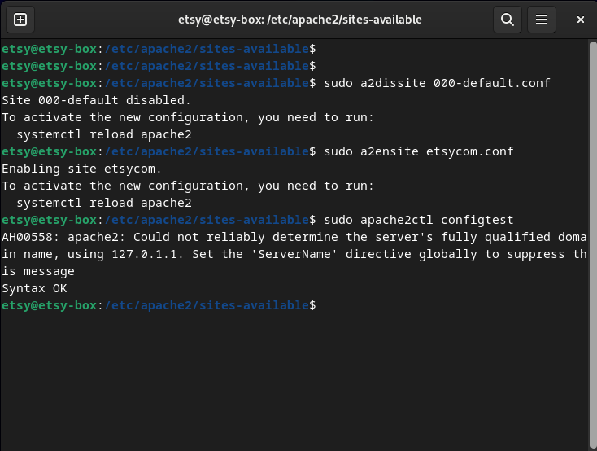
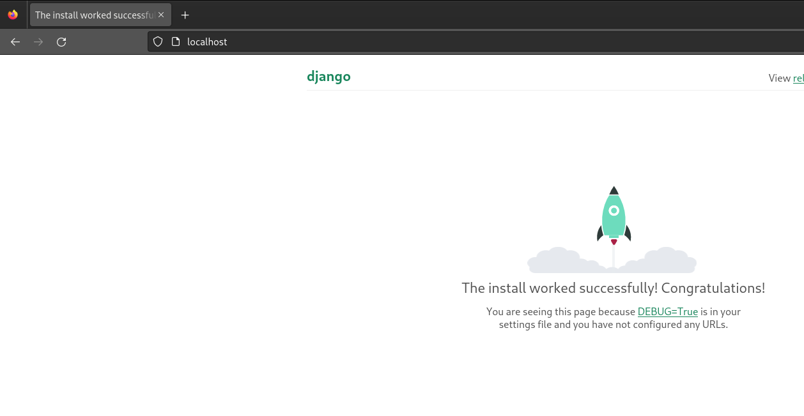
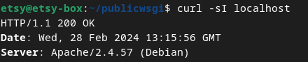
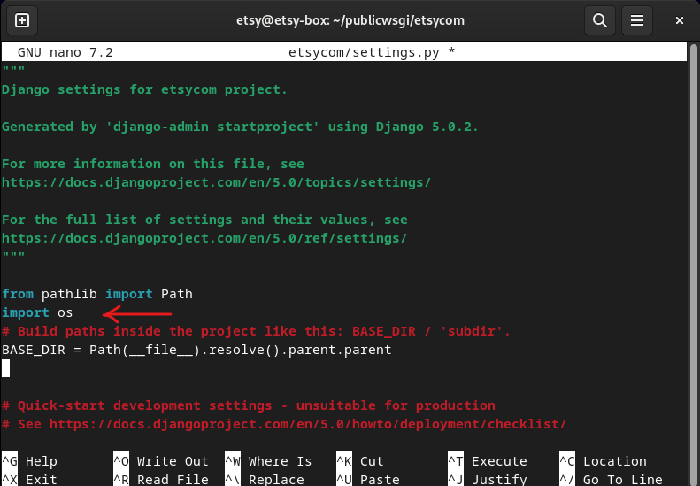
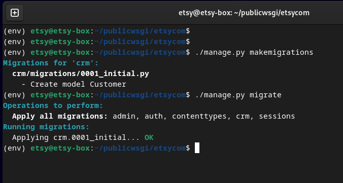
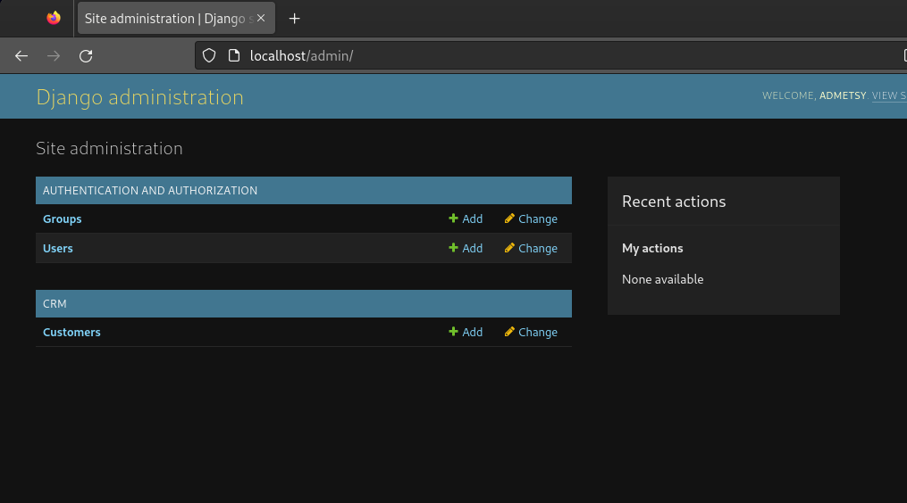

# Indroduction

It was time for homework number six. This assignment was essentially split into two different tasks. The first task was about summarizations. In the task I was supposed to summarize two different posts by Tero Karvinen. (Karvinen 2024.) These posts were the posts I used as a guide while doing the other task. The first post is titled "Deploy Django 4 - Production Install" (Karvinen 2022, Production install) and the second one is titled "Django 4 Instant Customer Database Tutorial" (Karvinen 2022, CRM). In the other task I was supposed to do a succesfull production install of Django and create a simple app.

# Deploy Django 4 - Production Install summed up

- Install Apache with `sudo apt-get -y install apache2`. Remember to update first `sudo apt-get update`. Test it. Replace the test site. `echo "hello" | sudo tee /var/www/html/index.html` works well. Test it again.
- Create directories in home directory. `mkdir -p publicwsgi/testcom/static/` -> `echo "hello" | tee publicwsgi/testcom/static/index.html`.
- Create a new virtualhost. `sudoedit /etc/apache2/sites-available/testcom.conf`. Write the conf and save. Disable the default conf and enable the newly created conf. `sudo a2dissite 000-default.conf ` -> `sudo a2ensite testcom.conf`. Do a configtest `/sbin/apache2ctl configtest`. Fix the possible errors. Restart Apache `sudo systemctl restart apache2`. Check the site.
- Create a Virtualenv. Install with `sudo apt-get -y install virtualenv`. Go to the ~/publicwsgi directory. Create the env with `virtualenv --system-site-packages -p python3 env`.
- Activate it with `source env/bin/activate`. Check that the pip is from env with `which pip`. Create a requirements.txt file with django written in it. Double check that it's written correctly. Install Django with `pip install -r requirements.txt` and check the version with `django-admin version`.
- Start a project with `django-admin startproject testcom`. Sudoedit the testcom.conf. Add the correct lines and variables. Install the wsgi module with `sudo apt-get -y install libapache2-mod-wsgi-py3`. Check the syntax again and restart Apache. Check the site. Make sure that it's Apache and not the dev server with `curl -sI localhost | grep Server`.
- Disable debug by changing directory into publicwsgi/testcom and there using `micro testcom/settings.py`. Change the DEBUG value to False and add localhost and the name that is visible when looking at the site to the ALLOWED_HOSTS list. Save and use `touch testcom/wsgi.py`. For bigger changes `sudo systemctl restart apache2`. Check the site. 404 is good at this point.
- Open the settings again. Add `import os` with the rest of imports at the start. Add `STATIC_ROOT = os.path.join(BASE_DIR, 'static/')` below STATIC_URL. Use `./manage.py collectstatic`. Check the admin site.

(Karvinen 2022, Production install)

# Django 4 Instant Customer Database Tutorial summed up

- Update databases with `./manage.py makemigrations` and `./manage.py migrate`. Add a user with `./manage.py createsuperuser`.
- Create a new crm app with `./manage.py startapp crm`. Open the settings with `micro testcom/settings.py`. Add crm into the INSTALLED_APPS list.
- Open the models.py with `micro crm/models.py`. Add a class Customer with a character field from the models module. Save and use `./manage.py makemigrations` and `./manage.py migrate`.
- Open the admin.py with `micro crm/admin.py`. Link the Customer model to the admin.py. Restart the site and check it out.
- Open the models.py and define a function that shows the names of the customer instead of "Customer object".

(Karvinen 2022, CRM)

# The main task

## Essential background information

I did things a little bit differently this time. I didn't write this report while doing the task like I used to do. This time I just made a short one liner notes while doing the task. I then built this report from those notes. This allowed me to fully focus on the task and I was done with it faster. I wanted to do this task from scratch, so I decided to do it on another VM. This VM had GNOME desktop environment instead of xfce which is why it looks a bit different. I have used this VM as a lab machine inside a test environment. To make it safe I had to close firewall ports, delete vulnerable users, change the network mode to NAT and purge apache2. I also decided to disable it and stop the SSH. Once I was done with those, I started doing this task.

My sysinfo.txt was still valid.

288 GB of free space on SSD, I was home in Vaasa, and I used a good wireless connection. The VM had 4 GB of RAM, 2 processors and 50 GB of storage.

## Production install

### Apache

I started this at 2:41 PM. First, I opened the VirtualBox application, selected the correct VM and hit start.

Once I was in, I updated the repos and upgraded packages with `sudo apt update` and `sudo apt upgrade`. Then I installed Apache with `sudo apt install apache2`. Once it was installed, I made my way to the sites-available directory and there I created a new configuration file named etsycom.

Inside it I wrote the config using Tero's guide (Karvinen 2022, Production install) as a reference since it was a bit different from the last few times.

After this was done, I made the directory.

I disabled the default conf, enabled the new conf and did a configtest.

The syntax was ok, so I made an index.html file inside the correct directory and then I tested it.

Localhost showed the default page. I forgot to restart the service, so I did it.

Well, that didn't work until I realized that the /static was declared inside the config. Then I tried localhost/static/ and that worked.

### Django

I installed virtualenv.

Then I created the environment (Karvinen 2022, Production install).

I activated it, checked that the pip is correct and created a requirements file with django correctly written in it (Karvinen 2022, Production install).

After these steps I installed django and checked the installed version.

I started a new project and ran into an error which was expected since I had the directories already.

I removed the directories and started the project succesfully this time.

Here I deactivated the virtualenv since I was really confused on how this thing works.

I understood it like it was supposed to be activated when modifying things inside these directories /publicwsgi/... Later on I noticed that I didn't remember to activate it before making changes, so now I think that it is good to have it activated when running manage.py script but is it mandatory when for example changing setting. I need to play around with it some more to understand the logic fully. After I deactivated it I started to edit the etsycom.conf once more. I opened another shell where I copied the path to TVENV.

I wrote the whole config manually by copying Tero's (Karvinen 2022, Production install) config from the guide.

I wanted to write it manually to understand the config more in depth. Then I installed the wsgi module (Karvinen 2022, Production install).

The installation already showed me that there was some errors in the config. I checked the cofig with configtest as well.

I opened the config with sudoedit and found the error. I had put two closing directories...

Maybe I should just copy these configs when tired. Well, I fixed the issue and tested the config once more.

I forgot `>`. I added it and the syntax was ok.

I restarted the service with `sudo systemctl restart apache2` and checked the localhost.

A rocket was taking off! I checked that it was running on Apache (Karvinen 2024, Production install).

### Disabling debug and applying static assets

I started this at 3:16 PM. First, I opened the setting.py file (Karvinen 2022, Production install).

There I changed the DEBUG = from True to False and added localhost into the ALLOWED_HOSTS (Karvinen 2022, Production install).

I used touch to load the changes (Karvinen 2022, Production install). Then I checked the site. Not Found was expected.

I opened the settings again. This time I added `import os` at the start and `STATIC_ROOT = os.path.join(BASE_DIR, 'static/')` after the STATIC_URL (Karvinen 2022, Production install).

At this point I noticed that I forgot to activate the env again, so I changed to the publicwsgi directory and used `source env/bin/activate` before going to the etsycom and using manage.py.

Then I checked that the localhost/admin shows the login screen correctly.

The localhost itself doesn't show anything and the localhost/static showed an error.

I deactivated the env and checked the logs and noticed that the index.html is missing since I removed it some time ago when creating the project.

Here I just checked how the things are organized.

Then I made a simple index.html file and checked it.

### CRM

I started this at 3:30 PM. First, I made my way back to the publicwsgi, activated the venv and then made my way to the dir where manage.py was.

I updated the databases and created an admin user (Karvinen 2022, CRM).

Then I tried it, and I was in (Karvinen 2022, CRM).

Here I forgot to startapp the crm before going to add it to the installed apps. I opened the settings with the same command `nano etsycom/settings.py` and there I added crm to the installed apps (Karvinen 2022, CRM).

Now this created a problem when I used manage.py startapp crm.

I removed the crm from the settings and used the startapp crm (Karvinen 2022, CRM).

Then I added the crm back to the settings and after that I opened the models.py.

There I added a customer class (Karvinen 2022, CRM).

Updated the databases.

Opened the admin.py and linked them together (Karvinen 2022, CRM).

Then went to check it but it wasn't showing.

I updated the database and restarted Apache.

Now it was there.

There I added five objects with the add button.

To make the names show I opened the models.py once again with `nano crm/models.py` and added a short function. (Karvinen 2022, CRM.)

Then I did the usual and went to check the site again.

It worked!

I was done at 3:54 PM

# My optional task.

I wanted to make another app since the crm app was done using Tero's step by step guide.

On Thursday I woke up and decided to play around with the models.py and admin.py files on my main VM muumi. I played around for a bit, and I started to understand the logic behind these. I made a simple app with the use of chatgpt and a couple of references. When I was at a point that I understood the code and understood why it works I wanted to create a simple app as my optional task. The reason I didn't make a report out of the playing around bit is because I was just playing around with the tools and testing how everything looks and works.

Before this course started, I had planned to do a little project in my freetime. I wanted to make an internal network website with a Linux machine where the website uses a little database with different recipes in it. The website would randomly select different foods for me and my partner to eat during the week. I also wanted to buy a Raspberry pi and have it show these recipes with my old tv. As a bonus I wanted to make the site a bit more appealing. I wanted to do this project to learn a bit about Linux, databases, websites and so on. Unfortunately, I never had the time to even start this. The results of this optional task I did were something along those lines of the first part of my project, so I was happy with the outcome. The app is for planning what to eat for a week.

I started doing this at 11:08 AM. First, I opened the VirtualBox application and started the etsy-box VM. Once I was in, I checked that the site was still going with Firefox.

Then I navigated to the publicwsgi directory with `cd publicwsgi`. There I activated the env with `source env/bin/activate` and after it was activated, I made my way downwards with `cd etsycom`. Once there I started a new app.

Then I opened the settings and added the new app into the installed app list.

Then I opened the models.py file.

This is the code I wrote.

It was similar to the code I wrote when messing around before this, so I used it as a reference. When messing around I used Mozilla's post (Mozilla s.a) and chatgpt as references.

        from django.db import models # this was already there

        class Food(models.Model): # created a class called Food

                food = models.CharField(max_length=100) # created a characterfield named food with the maximum length of 100
                description = models.TextField() # created a textfield named description (Mozilla s.a).
                coming = models.BooleanField(default=false) # with the help of chatgpt I created a booleanfield with the name coming (upcoming). I meant that something is upcoming this week or next week
                amount = models.IntegerField(null=True) # Added this for the sake of it (Mozilla s.a). Had a problem with this when messing around. Adding null=True fixed the problem

                WEEKDAYS = (
                    ('monday','Monday'),
                    ('tuesday','Tuesday'),
                    ('wednesday','Wednesday'),  # Here I created a dropdown list with the help of chatgpt. I asked it to explain to me on how a dropdown list is made.
                    ('thursday','Thursday'),
                    ('friday','Friday'),
                    ('saturday','Saturday'),
                    ('-','-'),
                )

                weekday = models.CharField(max_length=10, choices=WEEKDAYS, default='') # Here is the actual characterfield where the dropdown list is. Adding the default value to be '' fixed a problem.
                created = models.DateTimeField(auto_now_add=True) # I added this for the sake of it (Mozilla s.a).

                def __str__(self):
                    return self.food

Using upcoming instead of coming would have been a better choice of words... but oh well it is what it is. After it was done, I used `./manage.py makemigrations` which returned an error message.

I fixed it and had a second one.

Fixed it as well and then it was ok.

Then I opened the admin.py file.

There I linked the models to the admin page.

Then I restarted Apache with `sudo systemctl restart apache2` and checked the site.

I opened the Foods tab and clicked on add food.

This is what it looks like.

First you add the food, then the description, check the box if you are planning on making the food this or next week, select the amount and add a weekday or and a line if you aren't planning on making the food this or next week. I added a couple of entries.

At this point it still looks a bit barebones. To fix it I opened the admin.py file once again.

There I added this:

        class FoodAdmin(Admin.ModelAdmin): # I asked chatgpt on how to make some of the things visible without opening the entry. It gave me a frame which I modified to my liking.
                list_display = ['food', 'coming', 'description', 'weekday', 'amount'] # These are the fields I wanted to be visible and I created inside the models.py

I tried did the usual `sudo systemctl restart apache2` and checked the site, but nothing had changed so I opened the admin.py again and noticed that I forgot to add the FoodAdmin to the admin.site.register, so I added it.

Then I restarted Apache and checked the site. Every time I check a site for new stuff I use Shift reload. There we go. This is what it looks like now.

They can also be sorted. Here I sorted them with so the ones that I wanna make this week or next week show up first.

Here I wanted to show the dropdown list when choosing a weekday.

Here I added one more entry.

Here I opened the salmon entry.

The history can be viewed by clicking history. Here we can see the date and time when it was added.

I noticed that the time was off by 2 hours, so I checked the settings. The time zone was UTC, so I tried to change it to UTC+2.

Makemigrations didn't like it

so, I opened the Django documentation (Django s.a) and found out that the timezone can be written like this 'Europe/Helsinki'. I opened the settings once more and changed the value to match that.

I restarted Apache and checked the site. There it was, the time was corrected.

I was done at 11:51 AM.

# References

ChatGPT. Questions asked on February 29, 2024.

Django, s.a. Time zones. Documentation. Available at [https://docs.djangoproject.com/en/5.0/topics/i18n/timezones/](https://docs.djangoproject.com/en/5.0/topics/i18n/timezones/). Read on February 29, 2024.

Karvinen, T. January 11, 2024. Linux Palvelimet 2024 alkukevät. Available at [https://terokarvinen.com/2024/linux-palvelimet-2024-alkukevat/](https://terokarvinen.com/2024/linux-palvelimet-2024-alkukevat/)

Karvinen, T. February 13, 2022. Deploy Django 4 - Production Install. Available at [https://terokarvinen.com/2022/deploy-django/](https://terokarvinen.com/2022/deploy-django/). Read on February 28, 2024.

Karvinen, T. February 13, 2022. Django 4 Instant Customer Database Tutorial. Available at [https://terokarvinen.com/2022/django-instant-crm-tutorial/](https://terokarvinen.com/2022/django-instant-crm-tutorial/). Read on February 28, 2024.

Mozilla, s.a. Django Tutorial Part 3: Using models. mdn web docs. Available at [https://developer.mozilla.org/en-US/docs/Learn/Server-side/Django/Models](https://developer.mozilla.org/en-US/docs/Learn/Server-side/Django/Models). Read on February 29, 2024.
