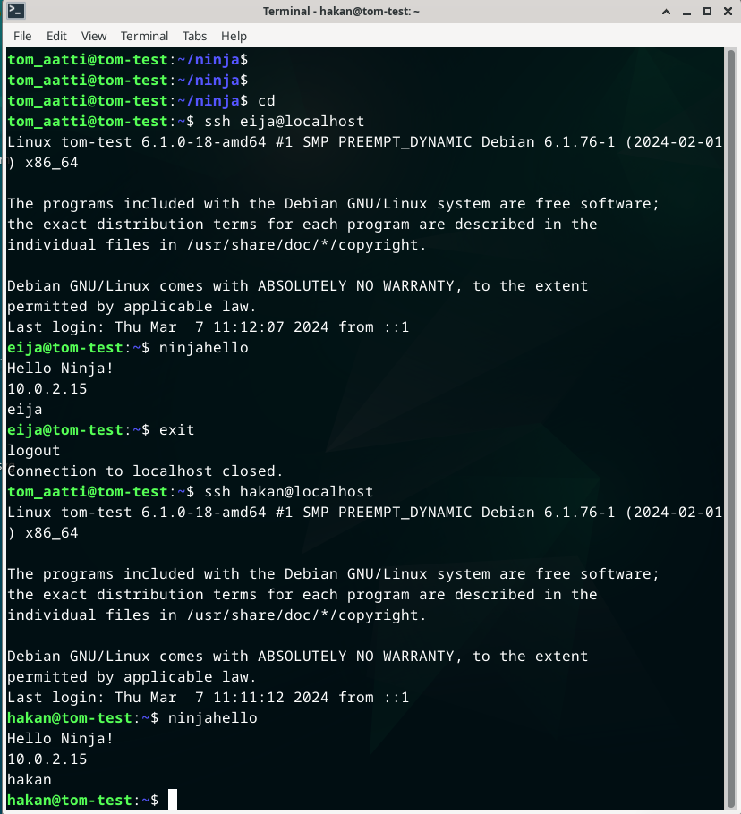
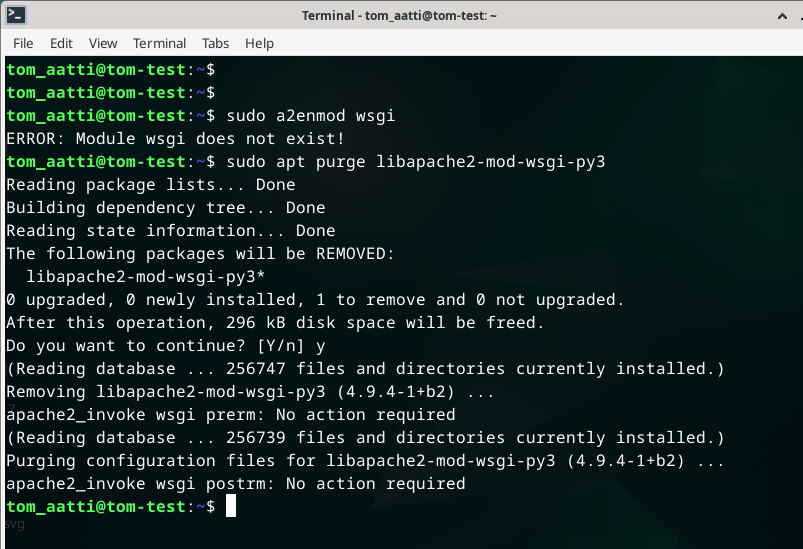
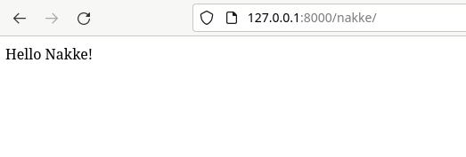
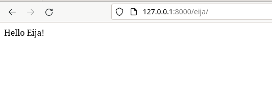
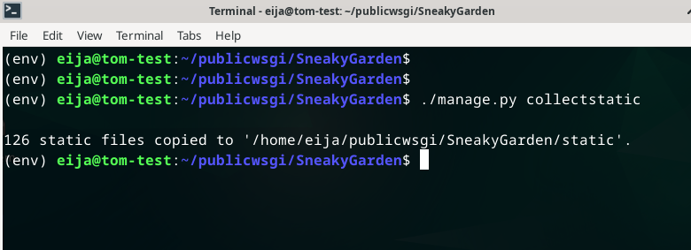
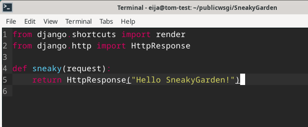
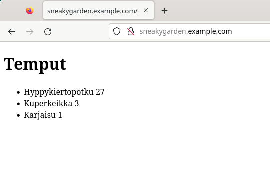
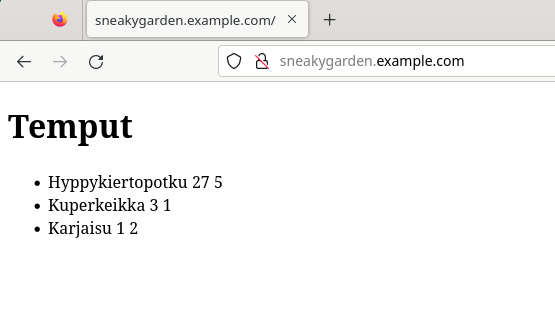
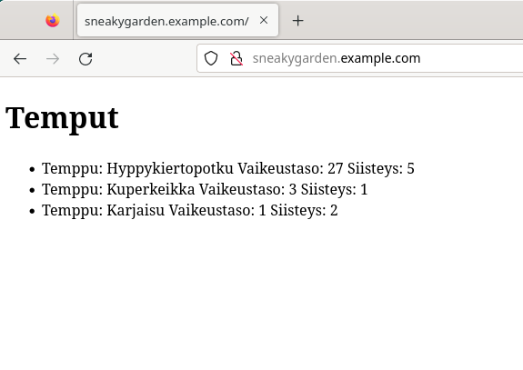

# Introduction

The last homework assignment of this course. There's four subtasks with an additional bonus task.
- a) Create a "Hello World!" program with a language of choosing
- b) Create a new command in Linux that any user could use
- c) Do a graded lab assignment from an earlier course
- d) Create a fresh new virtual machine for the graded lab assignment
- bonus) List your optional tasks and updated tasks that you have done

(Karvinen 2024)

# Essential information

In addition to information on this screenshot, I had 287 GB of free space on my SSD, I used a wireless connection and I was home in Vaasa. With the limited time I had on March 5, 2024, I only decided to do the first two task and the other tasks later.

## Hello World!

First I opened the VirtualBox application and selected the correct machine this time being the main VM. I logged in and opened the terminal with Ctrl + Alt + T. I got a greeting from a cow since I made a script earlier today that runs every time I open the terminal.

I changed directory to a newly made directory I made earlier today. I used `cd skripti` to do this. Here's a little showcase on the simple scripts I made during the lecture.

kokeilu.sh and uusikomento were testing scripts so there were no reason for me to show them. This is a python script that takes three arguments.

A name, number 1 and number 2. If the name argument is empty it prints "You didn't give a name". Else it just greets the name. I asked ChatGPT on how to grab the argument from the terminal and use it in a python script. I used It's answer as a reference for the if else lines. Everything else I added by myself. I wanted it to work even when an IndexError or NameError would occur on these lines so I added try except blocks to counter this. The rest of the script just takes the last two arguments as variables and multiplies them in the print statement.

The pyskripti.py is just a simple if, else script with user inputs.

The skripti.sh is the shell script that runs when I open a terminal.

It gets the current hour and uses it in if, else statements. If it is under 12 It uses cowsay to print good morning, if it's under 18 it prints good day and in other cases it prints good evening. After this it prints a line with echo and under it the current date. To make it run when a terminal is opened I simply added the path to the .bashrc.

Now to the task at hand. I started part A at 5:18 PM. First I made a new file called helloword.

I added the shebang line and added the print("Hello World!").

It was done and it worked.

I was done at 5:19 PM.

## A new command

I had already made two of the scripts universal during the lecture.

I tested that it works and I even created a new user and tested it with it as well.

I was assignment to create a new command so I started at 5:34 PM. First I removed helloworld and uusikomento since I didn't need them anymore. I created a new file with the name new...

I created a simple bash script. First the shebang! Then I created a variable user that grabs the output of whoami command. Then I created a simple if, else that checks the username currently operating. If the name is voldemort it prints a message saying that he's not welcome. If the username is something else the user is welcomed.

Tested it and ran into a syntax error. Well I forgot the fi.

That's something I need to get used to. I added it and it then worked.

I added the permissions to execute the script. It had read permissions on by default.

I tested it with ./new and then I copied it over to /usr/local/bin/. It works simply with new.

I tested it with voldemort and it worked like a charm.

I was at 5:41 PM.

## A lab assignment from a previous course done adaptively

It was on March 7, 2024 when I started working on this task. To do this task I used one of my VMs called Testikone. It had 2048 MB of memory, 50 GB of storage and one CPU. I started at 10:32 AM by opening VirtualBox and starting this machine.

Earlier I had made a drawing on things to remember.

I started with `sudo apt update` and `sudo apt upgrade`. I already had ufw installed but I simulated on how to install it here.

Then I installed Apache with `sudo apt install apache2` and SSH client/server with `sudo install ssh`. I checked the statuses. I also installed micro with `sudo apt install micro`

Then I curled the localhost to check that it gives the status code 200.

I was working on this machine alone, so opening ports for SSH and Apache were unnecessary things to do. `sudo ufw allow 22/tcp` opens the port 22 for SSH and `sudo ufw allow 80/tcp` opens the port 80 for http traffic. Here I tested that I could SSH with a password.

I exited and added the first user Nakke.

Tested it.

Here I made a new directory named users and totally created a file called names inside the home directory rendering the newly created directory useless.

Then I generated a key pair.

I copied the public key to tom_aatti and tested it.

There's probably better ways of doing this when there's multiple users. I script would automate it or the authorized_keys could probably be copied straigth to other users home directory. I decided to do it like this because there isn't that many users to do this on. Here I tested that the user nakke shouldn't be able to connect with keys.

I was correct. So I did the same with user nakke `ssh-copy-id nakke@localhost` and tested it.

I created the other users with `sudo adduser [username]`. First I tried to add everyone at the same time with `sudo adduser user1 user2 user3 user4`. This didn't work and the error stated that only one or two can be created at the same time. Well I tried it but I tried it with håkan and the character å wasn't permitted so I created hakan and everyone else individually. Here's the users.

Then I gave everyone the authorized_key with `ssh-copy-id username@localhost` and after this I tested that I could login via SSH without a password.

Remember the useless directory called users? Well I renamed it to ninja. There I created a file called ninjahello.

The colorscheme in micro can be changed with opening the command line with Ctrl + e and using a command `set colorscheme [the name of the scheme]`. I tested the script.

Then I added the execute permission and tested it with `./ninjahello`. After testing it I copied it over to /usr/local/bin/ to make it available to every user and with just `ninjahello`.

I tested it with every user. 

Then I tested it inside another directory.

Here happened something. I wrote a faulty command and decided to drop it and move on to another thing... I guess I had other things in mind. The command didn't work because there were no sudo and there was an extra space. It should have been `sudoedit /etc/apache2/sites-available/ninjacom.conf` not `micro /etc/apache2/sites-available/ ninjacom.conf`.

I guess at this point I just had the thought that I should show how to make holes to the ufw so I demonstrated it here.

And here I opened the sshd_config to disable password authentication and root login via ssh.

### Django

At 11:28 AM I created a new directory, installed virtualenv and created the environment.

I activated it, checked the pip and created a file with django in it.

Then I installed django and checked the version.

I created a new project and decided that now was the time to create the ninjacom.conf file.

Copied the conf from Tero and changed the variables.

Then I disabled the default conf and enabled the newly created conf. Configtest printed out errors.

First I checked that the mod is installed and retried the configtest.

Since the error stated that the error.log could have some additional information, I went ahead and checked it.

Nothing that could help me. Then I checked if it even exists and an error popped up. Well then I just decided to purge it and install it again which worked.

I restarted Apache.

Checked localhost.

Then checked that the page was indeed hosted by Apache.

Activated the env and started a new app called userpages.

Started editing the views.

After the screenshot I noticed that I forgot to add commas so I went ahead and added them. Then I created urls.py inside the same directory.

The same happened so I added the commas after. Then I opened the projects urls.py file and modified it.

No module called userapps. I opened the file again and realized that the app wasn't named userapp but it was userpages, so I fixed it.

Then the devserver launched correctly.

Everyone has a homepage.

And a test without the real server.

### SneakyGarden.example.com

After a tiny break I continued my work at 12:35 PM. First, I started editing the ninjacom.conf.

I only copied the conf and made a new conf SneakyGarden.example.com.conf with `EDITOR=micro sudoedit /etc/apache2/sites-available/SneakyGarden.com.conf`. I could've just copied the ninjacom and changed it's name, but the saved time would have been minimal. I changed the variables.

I witched to user eija and created a new directory.

Then I created an env and activated it.

Created the file with django written in it and installed it. Then I started a new project SneakyGarden.

Since eija doesn't have permissions to use sudo, I exited back to tom_aatti and disabled, enabled and tested the config. Restarted Apache with `sudo systemctl restart apache2`. Later I opened another terminal with tom_aatti so I wouln't have to switch users every time.

While I was tom_aatti I decided to modify the hosts file. I opened it with `sudoedit /etc/hosts`. I added SneakyGarden.example.com.

Then I tested it and got a forbidden error.

So I opened the last record of the error.log and found out that there isn't enough permissions in the path.

I switched to eija with `su eija`. I checked the permissions and indeed a component in the path was missing the needed permissions. I added read permissions and went to test it without success. That's where I remembered that the execute permission was needed here as well so I added it with `chmod +x eija`.

Checked it and ran into a new problem wich was visible bacouse I had the DEBUG=True. This was self explanatory. 

localhost answered.

I opened the projects settings.

I changed DEBUG to False and added two entries to allowed hosts.

I restarted Apache with tom_aatti and did some unnecessary moving around.

Then it was not found which was expected.

With eija, I opened the settings once more with micro `SneakyGarden/settings.py` and added `import os` at the start.

Then I added the line number 119 to the settings.

I copied the static files.

At this point the admin login looked good.

Then I started a new app called sneaky.

I modified the views.py file with `micro sneaky/views.py`.

Then I created an urls.py file with `micro sneaky/urls.py` and added this.

After it was done, I opened the projects urls.py file with `micro SneakyGarden/urls.py` and modified it.

At this point there was a greeting at `sneakygarden.example.com`.

I added the app into the installed apps by opening the settings with `micro SneakyGarden/settings.py`

Then I migrated.

Created a superuser eija.

I opened the models.py with `micro sneaky/models.py` and added this.

I migrated again.

I modified the admin.py file by opening it with `micro sneaky/admin.py`.

I restarted Apache as tom_aatti and checked the admin site.

I'm missing a screenshot here, but I created a couple of entries. Then I opened the models.py once again and added a function at the end.

I restarted Apache with tom_aatti and got a Server Error.

The Admin site was working fine but when opening the listing for the Moovit the server error appears. So the function I just created broke something. I checked the models.py and admin.py in detail, but I didn't find anything worth noting. I also commented the function out to rule out other problems but nothing new popped up. So at this point I decided to put the DEBUG back on. I opened the settings and changed False to True. This was the error.

Then I realized that I had written

        def __str__(self):
            return self.name

instead of

        def __str__(self):
            return self.temppu

To fix this I decided to change the temppu to name and vaikeus to difficulty.

Should anyway use English words instead of Finnish words.

I migrated and restarted Apache. Then I checked the site, and it looked good. Forgot to add, but here I changed the DEBUG back to False.

I created a templates directory and a tricks.html file inside it. Inside the html file I only added the <!DOCTYPE html>, <html> and <body> brackets.

Then I modified the views.py by opening it first with `micro sneaky/views.py`.

Then I opened the template html with `micro sneaky/templates/tricks.html` and added this.

After the usual restarts I checked the site and it looked good.

### A new admin

After a break I continued at 2:50 PM. First I added the new admin Jussi Laivatalo and checked the groups.

Then I added Jussi to the sudo group and copied the public key.

I connected via SSH and tested that jussi had sudo privileges.

Then as a personal bonus test I wanted to give eija the permissions to run `sudo systemctl restart apache2` only. First I checked the systemctl.

Opened the sudoers file with `sudo visudo`. Under root I added eija. NOPASSWD means that the command can be run without a password and then the actual command. Since this VM is a test VM, there's no harm in testing these and learning.

I switched to eija and tested it. Then I switched back to tom_aatti to check the status and it worked. Eija can't use `sudo systemctl status apache` so I had to check it like this.

Here I made sure that eija can't use status or update.

Then I decided to add coolness into the database. I switched to eija and made my way into ~/publicwsgi and activated the env. Then I went deeper into SneakyGarden and there I used `micro sneaky/models.py`.

Then I opened the admin.py with `micro sneaky/admin.py`.

I restarted Apache and migrated and checked the admin site. Nothing changed so I checked the admin.py again and added MoovitAdmin into this line.

I restarted Apache and migrated, checked the site and added coolness levels to the moves.

I forgot to take a screenshot of the dropdown box when choosing coolness. The coolness is choosed by using the dropdown and choosing a value from 1-5. Then I added the coolness into the template html file. I opened the file with `micro sneaky/templates/tricks.html`.

I did the usual by restarting Apache and migrating. Then I checked the main page.

Then I opened the html once more and added some text between the values. Then the usual restarts.

Here's the site

I was done at 3:22 PM. This part of the report has left me feeling drained. I decided to do the other tasks, fix spelling errors and add references another time.

## A fresh VM

Back to work on March 8, 2024 at 10:37 AM. I opened the VirtualBox application and clicked on new. Here's the specs I went for.

Then I started the machine and waited for a bit for it to start. After I got in I tested the connection by opening Firefox and checking wikipedia.org. It worked and I tested the opening the terminal and writing `whoami`. The network, mouse and keyboard all work. Then I launched the install debian app and clicked on launch anyway. I chose American English, Helsinki, Finnish default keyboard and tested it, checked the vbox harddisk annd selected erase disk, made sure the boot loader is MBR, I added my name, created a username, a hostname and created a strong password and finally I clicked install. Install took from 10:52 PM to 10:58 PM. Then I just restarted the machine. Then it froze so I forced a shutdown and started it again. Then I logged in, opened the terminal and used `sudo apt update`, `sudo apt upgrade` and `sudo apt-dist upgrade`. Once they were done I installed ufw with `sudo apt install ufw`. Then I enabled it with `sudo ufw enable`. Installing anything else was prohibited so this is where I left off. I was done at 11:08 PM.

## Optional

COMING SOON...

## References

WILL ADD ALL OF THEM LATER... THE TEXT REFERENCES AND THE REFERENCE LISTING.
