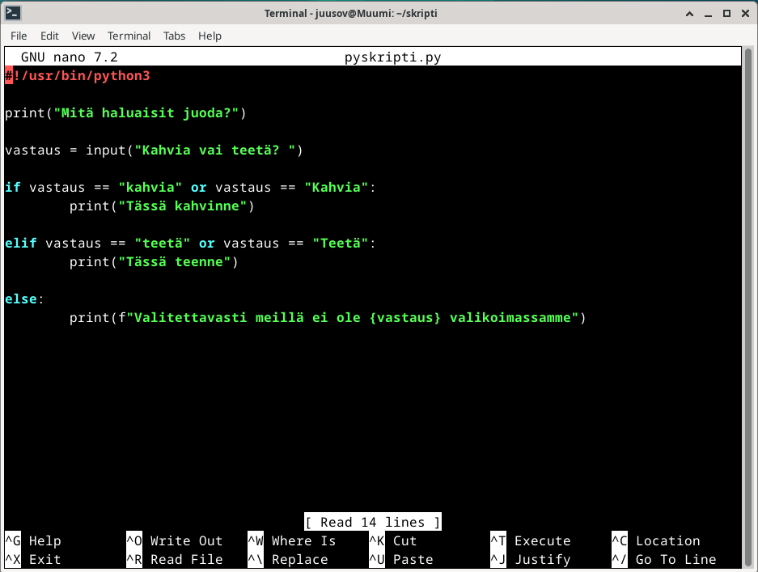
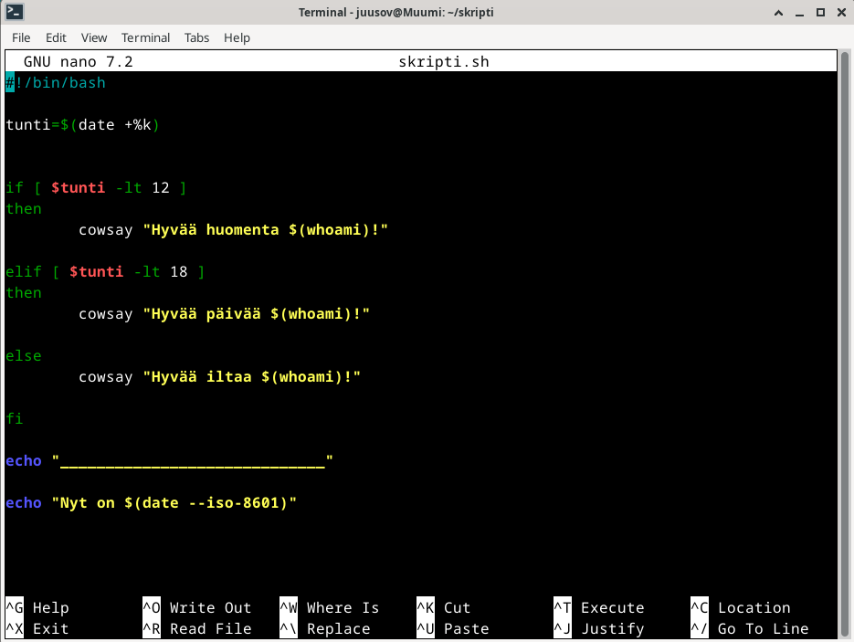

# Introduction

The last homework assignment of this course. There's four subtasks with an additional bonus task.
- a) Create a "Hello World!" program with a language of choosing
- b) Create a new command in Linux that any user could use
- c) Do a graded lab assignment from an earlier course
- d) Create a fresh new virtual machine for the graded lab assignment
- bonus) List your optional tasks and updated tasks that you have done

(Karvinen 2024)

# Essential information

In addition to information on this screenshot, I had 287 GB of free space on my SSD, I used a wireless connection and I was home in Vaasa. With the limited time I had on March 5, 2024, I only decided to do the first two task and the other tasks later.

## Hello World!

First I opened the VirtualBox application and selected the correct machine this time being the main VM. I logged in and opened the terminal with Ctrl + Alt + T. I got a greeting from a cow since I made a script earlier today that runs every time I open the terminal.

I changed directory to a newly made directory I made earlier today. I used `cd skripti` to do this. Here's a little showcase on the simple scripts I made during the lecture.

kokeilu.sh and uusikomento were testing scripts so there were no reason for me to show them. This is a python script that takes three arguments.

A name, number 1 and number 2. If the name argument is empty it prints "You didn't give a name". Else it just greets the name. I asked ChatGPT on how to grab the argument from the terminal and use it in a python script. I used It's answer as a reference for the if else lines. Everything else I added by myself. I wanted it to work even when an IndexError or NameError would occur on these lines so I added try except blocks to counter this. The rest of the script just takes the last two arguments as variables and multiplies them in the print statement.

The pyskripti.py is just a simple if, else script with user inputs.

The skripti.sh is the shell script that runs when I open a terminal.

It gets the current hour and uses it in if, else statements. If it is under 12 It uses cowsay to print good morning, if it's under 18 it prints good day and in other cases it prints good evening. After this it prints a line with echo and under it the current date. To make it run when a terminal is opened I simply added the path to the .bashrc.

Now to the task at hand. I started part A at 5:18 PM. First I made a new file called helloword.

I added the shebang line and added the print("Hello World!").

It was done and it worked.

I was done at 5:19 PM.

## A new command

I had already made two of the scripts universal during the lecture.

I tested that it works and I even created a new user and tested it with it as well.

I was assignment to create a new command so I started at 5:34 PM. First I removed helloworld and uusikomento since I didn't need them anymore. I created a new file with the name new...

I created a simple bash script. First the shebang! Then I created a variable user that grabs the output of whoami command. Then I created a simple if, else that checks the username currently operating. If the name is voldemort it prints a message saying that he's not welcome. If the username is something else the user is welcomed.

Tested it and ran into a syntax error. Well I forgot the fi.

That's something I need to get used to. I added it and it then worked.

I added the permissions to execute the script. It had read permissions on by default.

I tested it with ./new and then I copied it over to /usr/local/bin/. It works simply with new.

I tested it with voldemort and it worked like a charm.

I was at 5:41 PM.

## Earlier lab assignment

COMING SOON...

## A fresh VM

COMING SOON...

## Optional

COMING SOON...
